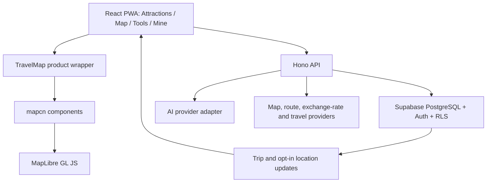

# China Stroll Architecture

## Tech Stack

- Client: React 19, TypeScript, Vite 8, Tailwind CSS 4, PWA
- Map: project-owned mapcn components on MapLibre GL JS
- API: Hono application shared by Cloudflare Pages Functions and a standalone Worker
- Database/Auth: Supabase PostgreSQL 17, Auth, Row Level Security and Realtime
- AI: provider abstraction in the Worker; current chat and embedding adapters use SiliconFlow-compatible APIs
- Validation: Zod, Vitest, oxlint, TypeScript and transactional SQL tests

Supported local runtime is Node.js 22 or 24 on Apple silicon. Dependencies are installed on the current machine with `npm ci`; copied `node_modules` directories are unsupported.

## System / Components

The four modules are presentation boundaries, not separate data silos. `Trip`, `Place`, `TripStop`, `Reservation` and authenticated user identity are shared application state.

## Frontend Information Architecture

- `/attractions`: current/nearby place, discovery, filters, recommendations and place detail.
- `/map`: map-first view of nearby and trip places, selected-place action sheet and navigation.
- `/tools`: navigation/taxi, payment/exchange, translation and service numbers.
- `/me`: profile, trip table, reservation table, members and privacy controls.

The application uses React Router with `BrowserRouter`; browser back/forward and direct loads preserve the four formal module paths. Place selection crosses modules through a stable `selectedPlaceId`; module components never copy a supplier-specific place object into their own state.

Cloudflare Pages uses its default SPA fallback because the project has no top-level `404.html`. A catch-all `_redirects` rule is intentionally absent: Wrangler 4.127 identifies `/* /index.html 200` as an infinite loop. `apps/web/public/_routes.json` keeps `/health` and `/v1/*` in the Pages Functions routing scope, so module paths return `index.html` while API paths continue to return JSON.

## Data Model

Existing core tables:

- Content: `places`, `place_localizations`, `guide_segments`, `place_sources`, `place_media`, `place_search_documents`, `place_visit_information`, `place_visit_information_sources`.
- Users/trips: `user_profiles`, `trips`, `trip_members`, `trip_invitations`, `trip_days`, `trip_stops`.
- Personal/agent: `place_library_items`, `reservations`, `agent_suggestions`, `trip_change_log`.

Planned location-sharing tables:

- `trip_location_sharing_preferences`: one row per trip member, containing `trip_id`, `user_id`, `enabled`, `enabled_at`, `expires_at`, `updated_at`.
- `trip_member_locations`: at most one current point per trip member, containing WGS84 coordinate, accuracy, recorded time and expiry.

RLS rules must require current trip membership for reads, the same authenticated user for preference/location writes, and an enabled non-expired preference. Disabling sharing deletes or makes the current location unreadable in the same server-side command. Historical location trails are out of scope for the first version.

Private place records and photos need separate tables before implementation; visibility defaults to `private`. Public community records must not reuse private storage paths or bypass moderation state.

## Place Data Publishing Pipeline

1. Source materials remain under `data/` and `references/`.
2. A version-controlled curated JSON package contains exactly the approved first 20 places.
3. Each place includes stable fields, WGS84 display coordinate, OSM traceability, `zh-CN` and `en` content, visit information and field-level sources.
4. A deterministic validator rejects missing languages, invalid coordinates, missing sources, malformed opening hours and stale review dates.
5. A deterministic generator produces an idempotent Supabase migration.
6. `npm run db:verify` rebuilds the local database twice and executes transactional permission/command tests.
7. Only published localization plus reviewed WGS84 coordinates are returned by public APIs.

Unknown dynamic facts remain explicitly unknown. Search snippets, aggregators and unsourced model output cannot publish opening times, price or booking rules.

## Display Image Pipeline

Source of truth: `data/processed/place-display-images`.

- Filename format is `<display-image-id>-stamp-square.(png|jpg)`.
- `forbidden-city` intentionally maps to the source image id `palace-museum`.
- A deterministic script validates coverage and copies/converts images to `apps/web/public/places`.
- Web code resolves a place to the generated public asset; it does not read `data/50景点图片附件`.
- Real photographs are excluded from build inputs.
- Generated images should be resized and encoded for web delivery while retaining the source mapping in a manifest.

## API Surface

Implemented:

- Public places: list, detail and guide.
- Authenticated place question and place-library endpoints.
- Place intelligence: reviewed local answers are public; paid SiliconFlow/Tavily calls are separately rate-limited per authenticated user or `CF-Connecting-IP`. The Tavily adapter validates the API payload and exposes only safe public HTTPS citations; it does not fetch search-result pages.
- Trip create/read, add day, add stop, create suggestion and confirm suggestion.

Next required endpoints:

- Versioned trip-stop patch, move and delete through `PATCH /v1/trips/:tripId/stops`.
- Reservation create/read/update/delete.
- Member invitation/acceptance.
- Preference-aware place recommendation.
- Location sharing enable/disable, current location update and associated-member read.
- User profile read/update.

All trip writes use a command id, expected trip version, permission check and change log. AI-generated changes use the same write path as explicit user changes.

## Key Interactions

### Discover to itinerary

Attractions list → place detail → choose day → add stop command → new trip version → Mine itinerary and Map update from the same snapshot.

### Mine itinerary editing

Mine adds only reviewed, not-yet-scheduled places to the selected day. Reordering normalizes the selected day's `sortOrder` values and writes the complete move set as one versioned command; deletion uses the same command boundary. The preview applies equivalent deterministic local transitions.

### Map navigation

Map/list selection → set `selectedPlaceId` → action sheet → user chooses Apple Maps, Google Maps or a China-local provider → external app/browser handles navigation. The internal map never claims its dotted visit-order line is a calculated route.

### Location sharing

Mine or Map privacy control → show associated members and sharing explanation → user enables switch → foreground geolocation permission → server stores an expiring current point → RLS exposes it only to current trip members. Turning the switch off stops browser watches and revokes server visibility.

### AI recommendation

Client sends explicit trip, preference and location scope → Worker retrieves a small set of reviewed place documents → model produces reasons and structured proposed changes → client previews impact → user confirms → server checks permission/version and writes.

## Directory Structure

- `apps/web`: React PWA and public generated display assets
- `apps/worker`: reusable Hono API
- `components/ui`: project-owned UI primitives including mapcn-derived map components
- `packages/shared`: domain types and deterministic shared logic. `src/place-contracts.ts` is the shared place contract boundary for catalog payloads plus question/recommendation trust invariants; `src/index.ts` re-exports it while place discovery logic lands separately.
- `functions`: Cloudflare Pages adapter
- `supabase`: migrations, database types and transactional SQL tests
- `scripts`: deterministic validation, generation and local verification commands
- `data`: source and processed content; most processed inputs are intentionally ignored from Git
- `references`: research, legacy PRD and historical implementation records
- `docs/superpowers`: approved feature designs and implementation plans

Root `PRODUCT.md`, `ARCHITECTURE.md`, `TASKS.md` and `AGENTS.md` are authoritative when legacy references conflict with the current product direction.

## Edge Cases & Failure Modes

- Location denied/unavailable: keep place search and manual map selection usable; do not silently keep sharing enabled without a location.
- Sharing disabled or expired: stop uploading and remove/restrict the last point immediately.
- Member removed: location and trip access end through RLS without waiting for a client refresh.
- Dynamic place information expired: display the reviewed text with a recheck warning; AI cannot convert it into a current certainty.
- Missing place image: fail the image-pipeline check before build; do not fall back to a real photograph.
- Map/route provider unavailable: keep the place list and third-party navigation links usable.
- AI unavailable: return reviewed guide excerpts or deterministic itinerary rules.
- Version conflict: do not apply stale trip or AI changes; reload and ask the user to review again.
- Offline trip write: do not queue and replay stale writes automatically.
- Build-native module failure: delete the exact project `node_modules` through `npm ci` and reinstall on this machine; never copy native bindings between machines.

## Security and Privacy

- Browser uses only publishable credentials; service-role and AI keys remain server-side.
- All public tables use RLS and explicit grants.
- Location, order numbers, preferences and private records use minimum visibility and retention.
- Logs must not contain raw access tokens, exact location history, service-role keys or AI secrets.
- Public community publishing requires a separate moderation gate and is not enabled by merely changing a record visibility field.
