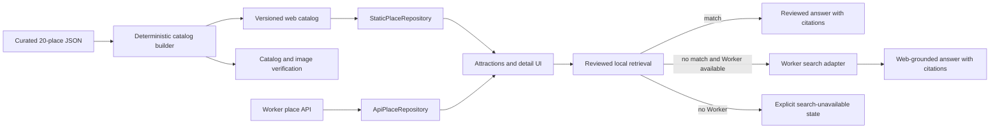

# Attractions 1.0 Design

## Status

Approved direction: one coherent Attractions module backed by the same reviewed 20-place package in preview and API modes, with reviewed local answers first and source-cited web search only when local content cannot answer the question.

This design completes Task 6 in `TASKS.md`. It does not implement the public community, private travel records, reservation CRUD, production map-provider selection, or location sharing.

## Goal

Make Attractions the trustworthy discovery entry point for Beijing:

- all 20 curated places are usable when only `npm run dev:web` is running;
- users can search and filter, inspect review status and sources, save a place, and add it to a selected trip day in no more than three actions;
- preference-based recommendations remain useful when an AI provider is unavailable;
- place questions use reviewed local material first;
- questions not covered locally may use a Worker-side web-search provider and must show real, clickable sources;
- the UI never presents an unsupported or unsourced answer as verified fact.

## Non-goals

- Publishing community posts, comments, moderation, reporting, or visibility controls.
- Uploading private place photos or travel records.
- Replacing display illustrations with real place photographs.
- Building audio playback or speech synthesis; the existing guide remains readable structured content.
- Adding new cities or publishing the remaining 32 place records.
- Selecting a permanent AI or web-search vendor in the frontend contract.
- Making secret-backed web search work in a browser-only process. `npm run dev:web` supports the complete reviewed catalog and local reviewed Q&A; web search requires the Worker or a deployed Functions environment.

## Chosen Approach

Generate a versioned static catalog from `data/curated/first-20-places.json`, then place a repository interface between UI components and their data source.

- `StaticPlaceRepository` reads the generated catalog for preview and browser-only development.
- `ApiPlaceRepository` calls the existing Worker endpoints in account and deployed modes.
- Both return shared package contracts, so Attractions and the detail panel do not contain data-source branches.
- Recommendation ranking is deterministic and shared. An AI model may improve explanation text, but it does not own eligibility or the fallback result set.
- Q&A uses a local reviewed-content retrieval step first. Only a no-match result can call the Worker search adapter.

This is preferred over importing the raw curated JSON into the web bundle because it avoids coupling the browser build to repository-only data and allows a small, explicitly published artifact. It is preferred over maintaining a separate hand-written preview dataset because that dataset would drift from the reviewed API records.

## System Boundaries



The frontend is responsible for local search, filtering, distance calculations, deterministic recommendations, reviewed-content retrieval, and presentation. The Worker is responsible for secret-backed model calls, web-search access, search-result normalization, rate controls, and production dependency failures.

## Published Place Catalog

### Source of truth

`data/curated/first-20-places.json` remains the only authored source. The catalog builder must not invent or enrich place facts. It selects and normalizes fields already present in the curated package.

### Generated artifact

The build produces locale-aware public catalog files under the web public directory. The exact split may be one file per locale or one combined file, but the public contract must contain:

- catalog version, build timestamp derived from source metadata, and review window;
- place summaries for list and map use;
- full localized detail content;
- localized visit information;
- general and child guide segments;
- normalized source citations;
- the approved display-image path for each place.

The artifact is generated and committed so `npm run dev:web` does not require a data-generation process on every start. Verification regenerates it in memory and fails when the committed artifact is stale.

### Verification rules

The existing place verification command is extended or paired with a catalog-specific verification step. It must fail when:

- the published set is not exactly 20 unique place IDs;
- a required English or Simplified Chinese localization is missing;
- a summary, detail, guide, or visit-information record cannot satisfy the shared contract;
- a cited source has no name, invalid URL, or review metadata;
- a display image does not resolve through the existing place-image manifest;
- any published image path falls outside the generated `place-display-images` output;
- regenerated catalog content differs from the committed artifact.

## Shared Contracts

The shared package becomes the boundary for both repositories.

### Repository surface

```ts
interface PlaceRepository {
  listPlaces(filters?: PlaceListFilters): Promise<PlaceListResponse>
  getPlace(placeId: string, locale?: Locale): Promise<PlaceDetail>
  getGuide(placeId: string, locale?: Locale, audience?: GuideAudience): Promise<PlaceGuideResponse>
  askPlace(input: PlaceQuestionRequest): Promise<PlaceQuestionResponse>
}
```

Authentication and API base URLs are constructor concerns of `ApiPlaceRepository`, not parameters passed through presentation components. `StaticPlaceRepository` implements `askPlace` for reviewed local answers and returns a typed `search-unavailable` dependency state when a local match is absent and no Worker is configured.

### Citation contract

Place sources and answers use one normalized citation shape:

```ts
type PlaceSourceCitation = {
  id: string
  name: string
  url: string
  publisher?: string
  publishedAt: string | null
  checkedAt: string
  reviewDueAt: string | null
  needsRecheck: boolean
  sourceType: "official" | "reviewed-reference" | "web"
}
```

`PlaceQuestionResponse` is extended to contain:

- `answer`;
- `answerMode`: `reviewed-local`, `model-grounded-local`, or `web-grounded`;
- normalized `sources` rather than opaque source IDs alone;
- `searchedAt` or reviewed-content update time;
- `generatedBy`: deterministic retrieval, model, or reviewed fallback;
- an optional warning or dependency status.

No UI is allowed to render `web-grounded` without at least one valid source URL.

### Recommendation contract

Recommendation input contains selected preference chips, optional natural-language context, locale, current coordinate when granted, nearby radius, available time, and planned place IDs. Each result contains a place ID, score, matched signals, concise reason, and whether the reason came from deterministic rules or a model.

## Repository Selection

`App` creates one repository during mode initialization:

- preview or browser-only development uses the static repository;
- account/deployed mode uses the API repository;
- an explicit development configuration may use the API repository without changing component props.

Attractions and `PlaceDetailPanel` receive the repository or domain callbacks. They must not import the singleton API client directly. Switching repository resets in-flight detail and question requests to prevent one mode's response from appearing in another mode.

## Attractions Page

### Current and nearby context

- When location is available, show the nearest reviewed place and distance.
- When location is denied or unavailable, explain the state and retain all non-distance discovery features.
- Location remains a one-time browser permission request in this task; it is not location sharing.
- Distance filters support 1, 3, and 5 kilometres and are disabled with explanatory text until a coordinate exists.

### Search and filters

The text index covers localized name, aliases, tags, short introduction, and curated highlights. Text search combines with category, maximum visit duration, and distance filters. Matching is case-insensitive for English and normalized for surrounding whitespace; Chinese terms do not require token boundaries.

The header shows the number of matching places. An empty result preserves the query and filters and offers one clear reset action. An empty catalog, catalog-load failure, and no filter match remain separate states.

### Place cards and actions

Every card shows the display illustration, name, short introduction, category, typical duration, and relevant distance or review indicator. Primary actions are Details, Save, and Add to selected day. Show on Map remains available through the existing cross-module selection.

Adding a place uses the day already selected in the app shell. A user can therefore add from the list in one action, or open details, select a day, and add in no more than three actions. Preview mode applies the deterministic local trip mutation; account mode retains the existing versioned API mutation.

## Place Detail

The detail panel continues as a modal/drawer and displays:

- display illustration;
- introduction, history, highlights, visitor advice, practical notes, and photo-spot notes;
- structured visit information, with fast-changing opening, ticket, booking, and entrance facts marked for recheck when overdue;
- general or child guide segments;
- source cards with publisher/name, review date, freshness status, and clickable URL;
- Save and Add to Day actions;
- external navigation options already supported by the application;
- place-specific Q&A.

Loading detail and guide content is independent from saving or adding the place. A detail failure retains the summary, display image, trip action, and external navigation rather than collapsing the whole panel.

## Preference Recommendation

### Input

The first release provides quick chips for Family, History, Relaxed, Photography, and Half day, plus an optional natural-language field. The user may also supply location through the existing permission flow. No preference is required to browse normally.

### Deterministic ranking

The baseline ranker uses only reviewed fields:

- tags and category match;
- duration fit, including a half-day ceiling;
- distance fit when location is available;
- penalty for places already planned, unless the user explicitly asks about them;
- stable place ID as the final tie-breaker.

Weights and chip-to-tag mappings live in one tested module. The same input always produces the same ordered result. The UI explains matched signals such as “history tag and fits a half day” instead of implying personal certainty.

### Optional model enhancement

When Worker AI is available, it may turn ranked signals into a more natural explanation or interpret optional free text into supported preference signals. It may not introduce an unpublished place or override hard duration/distance constraints. Invalid, timed-out, or unavailable model output falls back to the deterministic result and is labelled accordingly.

Results open details or add the place to the selected day. Recommendation failure never blocks the ordinary list.

## Place Q&A Pipeline

### 1. Reviewed local retrieval

Build a searchable document set from the current place's introduction, history, highlights, visitor tips, practical notes, photo notes, visit information, guide segments, and their source mappings. Retrieval returns a match only when the score crosses a tested threshold and at least one reviewed citation supports the selected passage.

A strong match produces a concise reviewed answer locally or sends only the matched passages to the configured model for grounded phrasing. Both outcomes remain labelled as reviewed local information and retain their citations.

### 2. Web-search fallback

Only a local no-match may call the Worker search endpoint. The request is restricted to place ID, question, and locale. The Worker resolves the reviewed place identity, constructs the search query, calls the configured provider, normalizes results, and generates an answer grounded in those results.

The initial provider is behind a `WebSearchProvider` interface. Provider selection is configuration, not a frontend dependency. If no provider is configured, the endpoint returns a typed dependency-unavailable response.

A web-grounded response must include at least one normalized HTTPS citation. The UI labels it “Web information,” shows clickable sources near the answer, and displays the retrieval time. If reliable sources are absent, the Worker returns an unable-to-confirm response rather than an answer.

### 3. Browser-only boundary

With only `npm run dev:web`, the catalog, filters, detail, guides, recommendation fallback, and reviewed local Q&A are complete. When local retrieval has no match, the UI explains that online search requires the API service and offers retry after it becomes available. Secrets are never placed in Vite environment variables exposed to the browser.

## Worker API

Existing public list, detail, and guide routes remain compatible. The question route adopts the extended response contract and search pipeline. Development may allow anonymous calls so preview can exercise the integrated path; production access is protected by explicit rate and usage controls and can later be restricted to authenticated users without changing the response shape.

The implementation should keep route policy explicit rather than accidentally moving the route above or below a broad authentication middleware. Tests cover both intended anonymous development behavior and production policy configuration.

The Worker returns existing structured API errors plus specific dependency details for model unavailable, search unavailable, timeout, and no reliable sources. Provider-specific payloads never reach the client.

## Security and Trust Boundaries

- AI and search credentials exist only in Worker secrets.
- The client cannot supply a URL to fetch; it supplies only place ID, locale, and question.
- Only public HTTPS citation URLs are returned. Localhost, loopback, link-local, private-network, credential-bearing, and non-HTTP(S) URLs are rejected.
- The first implementation prefers provider result titles, snippets, and URLs and does not perform arbitrary follow-up page fetching. If page fetching is later required, it needs separate SSRF controls and limits.
- Question length, request frequency, provider result count, response size, and total execution time are bounded.
- Search results are untrusted data. Prompts delimit them as evidence and explicitly ignore instructions contained inside them.
- The Worker does not claim a fact is official merely because a result mentions an official institution. Source type is determined from configured/validated domains or remains `web`.
- Failed web search cannot overwrite a valid local reviewed answer.
- Logs exclude access tokens, provider secrets, and full personal itinerary context.

## Loading, Empty, Error, and Permission States

- Catalog loading uses a visible progress state.
- A corrupt or incomplete catalog produces a diagnostic error and never silently falls back to the former three-place sample.
- No search/filter matches preserves the user's controls and offers reset.
- Location denial disables distance-only controls and retains all 20 places.
- Detail or guide failure retains summary and trip actions.
- AI recommendation failure uses deterministic ranking with a clear label.
- Local Q&A no-match plus unavailable Worker shows online-search unavailable, not a fabricated fallback.
- Web search timeout or no reliable source shows unable to confirm and permits retry.
- Save or add-to-day failure retains selection, panel position, and question text.
- Stale reviewed facts display a recheck warning and direct users to the cited source.

## Accessibility and Responsive Behavior

- Search has a persistent label; filter groups have accessible names and selected states beyond colour.
- Recommendation chips are toggle buttons with `aria-pressed`.
- Results and Q&A status changes use restrained live-region announcements.
- Source links have descriptive names and indicate that they open externally.
- Detail focus is contained and restored to the triggering card on close.
- All primary touch targets remain at least 44px.
- At 390px, filters wrap without horizontal scrolling, citations remain readable, and the bottom navigation does not cover the final action.

## Testing Strategy

### Data and contract tests

- Generate and verify exactly 20 localized catalog entries.
- Validate every catalog payload against shared runtime schemas.
- Verify every place image resolves to approved generated artwork.
- Verify source normalization, review freshness, and invalid-URL rejection.
- Run parity fixtures through static and API repositories and compare contract-shaped output.

### Unit and component tests

- Search matches names, aliases, tags, introductions, highlights, and Chinese terms.
- Category, duration, and distance filters combine correctly.
- Location denial leaves all non-distance results usable.
- Deterministic recommendation ordering, reasons, constraints, and tie-breaking are stable.
- Local Q&A match returns reviewed citations without calling web search.
- Local no-match calls search only when available.
- Web-grounded answers without citations are rejected.
- Detail loading/failure, save failure, add failure, AI unavailable, search unavailable, and no reliable source render distinct states.
- Preview mode loads all 20 places and detail content without Worker calls.

### Worker tests

- Validate place ID, locale, question length, rate policy, and provider configuration.
- Assert search is not called for a qualifying local match.
- Normalize valid search results and discard unsafe or malformed URLs.
- Handle model error, provider timeout, empty results, and malformed provider output.
- Ensure all web-grounded success responses contain at least one valid citation.
- Preserve compatibility for list, detail, guide, library, trip, and suggestion routes.

### Browser verification

- At 390x844, search for one of the 20 places, open details, inspect a source, and add it to the selected day in no more than three actions.
- Exercise normal, no-match, denied-location, AI-unavailable, search-unavailable, and mobile-overflow paths.
- Confirm preview works with only `npm run dev:web` and no requests to port 8787 for catalog/detail/guide/local-answer flows.
- Confirm an integrated development run produces a cited web answer only after a local no-match.
- Confirm keyboard traversal, focus restoration, and visible focus.

## Rollout and Compatibility

The static catalog and repository abstraction land before UI behavior switches. Existing Worker place routes remain additive-compatible during the transition. The question response may temporarily retain `sourceIds` for compatibility while the web consumes normalized `sources`; it is removed only after all clients migrate.

If the web-search provider is not configured at release time, Attractions 1.0 still ships with the complete reviewed catalog, deterministic recommendations, and local Q&A. The UI exposes the online-search unavailable state. Search provider enablement is an operational configuration change, not a frontend release dependency.

The former three-entry `samplePlaces` dataset is removed from runtime use after catalog parity tests pass. It may remain only in focused test fixtures if renamed to make its purpose explicit.

## Acceptance Criteria

1. Preview mode loads all 20 curated places, details, guides, sources, and approved display illustrations without a Worker.
2. Static and API repositories satisfy the same shared contracts.
3. Users can search names/aliases/content and combine category, duration, and 1/3/5-kilometre filters.
4. Denied location does not block ordinary discovery.
5. Every place detail exposes review state and clickable sources.
6. Save and add-to-day work in preview and account modes; add-to-day takes no more than three actions.
7. Preference chips and optional text produce useful recommendations, with a deterministic fallback when AI is unavailable.
8. Reviewed local material is always attempted before web search and is clearly labelled.
9. A web-grounded answer has real clickable citations and a retrieval time; otherwise the system states that it cannot confirm the answer.
10. Browser-only development clearly explains when online search requires the Worker.
11. Loading, empty, denied-location, AI-unavailable, search-unavailable, mutation-failure, and mobile states pass automated and browser verification.
12. The full project quality gate passes before Task 6 is marked complete.

## Rollback

The catalog builder and repository abstraction are additive. If the Attractions UI release regresses, routing can return to the current module while keeping catalog generation and shared contracts. If a search provider causes operational issues, its configuration can be disabled independently; reviewed catalog, local Q&A, and deterministic recommendations remain available.
