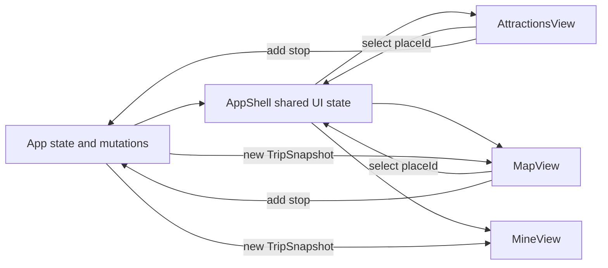

# Four-module Application Shell Design

## Status

Approved direction: Scheme B, formal routes for Attractions, Map, Tools and Mine.

This design covers the application-shell restructuring only. It preserves existing trip, place, guide, map and suggestion behavior while moving it into the confirmed information architecture. New reservation APIs, real location sharing, route calculation and full travel-tool integrations remain separate tasks in `TASKS.md`.

## Goal

Replace the planner-only page with a mobile-first four-module application shell:

- `/attractions` — discover, filter and understand places, then save or add them to a trip day.
- `/map` — view nearby and planned places spatially and open navigation actions.
- `/tools` — access real travel-support information and external actions without dead controls.
- `/me` — manage the current trip, days, itinerary, AI suggestions and account context.

The restructuring must not change the existing server contracts or weaken trip version, permission and confirmation behavior.

## Non-goals

- Implementing reservation CRUD.
- Implementing member invitation.
- Implementing location-sharing storage, RLS or live updates.
- Selecting the production basemap or road-routing provider.
- Building exchange-rate, taxi or translation provider integrations.
- Building the public place community.
- Removing preview mode.

## Chosen Approach

Use `react-router-dom` with `BrowserRouter` and four explicit routes. Add a Cloudflare Pages SPA fallback so direct URL loads return `index.html` while `/v1/*` and `/health` continue to be handled by Functions.

This is preferred over state-only tabs because browser history, refresh, direct links and future module-level analytics become predictable. It is preferred over anchor sections because the confirmed information architecture is a real product boundary rather than a visual relabelling of the existing planner.

Unknown client paths redirect to `/attractions`. Signed-out and trip-creation states remain outside the module shell; after a trip is ready, the user enters the last valid module or `/attractions`.

## Application Structure

```text
App
├── session and mode lifecycle
├── place/trip loading and mutations
├── WelcomeScreen / CreateTripScreen
└── AppShell
    ├── ModuleHeader
    ├── Routes
    │   ├── AttractionsView
    │   ├── MapView
    │   ├── ToolsView
    │   └── MineView
    ├── PlaceDetailPanel
    └── BottomNavigation
```

`App` remains the owner of authenticated session, preview/account mode, current trip, place collection, saved place IDs and mutation functions. The first restructuring does not introduce a global state library.

`AppShell` owns UI-level cross-module state:

- `selectedPlaceId`
- `detailPlaceId`
- selected trip day
- current browser location and permission status
- nearby radius
- place filters

This state is lifted out of the current `Planner` so Attractions and Map share the same selection and nearby result set. It is not persisted as a second copy of trip or place data.

## Route and Navigation Behavior

Bottom navigation is fixed on mobile and contains four labelled targets with icons. Labels remain visible; icons do not carry meaning alone.

| Route | Label | Primary responsibility |
| --- | --- | --- |
| `/attractions` | Attractions | Discovery, filters, details, save and add-to-day |
| `/map` | Map | Spatial selection, nearby places, trip highlights and navigation |
| `/tools` | Tools | Travel support and external actions |
| `/me` | Mine | Trip itinerary, days, suggestions and account context |

Desktop uses the same route model. Navigation may move to a left or top rail at wider breakpoints, but route names and order do not change.

Browser back returns to the previous module or previous in-app location. Opening a place detail uses the existing modal/drawer in the first iteration; closing it returns focus to the triggering control and does not create an extra route entry. A future shareable place-detail route can be added without changing module ownership.

## Module Designs

### Attractions

Attractions starts with a compact current-context card:

- when location is available, show the nearest reviewed place and distance;
- when location is unavailable or denied, show a clear action to enable location and retain normal browsing;
- when no place is within the loaded set, show a neutral “browse all reviewed places” state.

Below it, reuse the current category, duration and one/three/five-kilometre filters. The map is removed from this view. Place cards retain Details, Save state and Add to Day. Opening Details uses `PlaceDetailPanel`; selecting “Show on map” sets the place ID and navigates to `/map`.

Loading, request failure, no places and no filter matches remain distinct states.

### Map

Map uses the existing lazy-loaded `TravelMap` as its main content. It receives the same filtered places, trip stops, current location and `selectedPlaceId` as Attractions.

Above or over the map, show location and one/three/five-kilometre controls. Below the map on mobile, show a synchronized compact place list.

Selecting a marker or list item opens a mobile action sheet containing:

- place name and reviewed-content status;
- planned/not-planned state;
- Details;
- Add to selected trip day when applicable;
- Navigate;
- Cancel.

Navigate expands the existing Apple Maps, Google Maps and Amap choices. It does not choose a provider silently. The existing dotted line remains labelled as visit order, not calculated routing.

No location-sharing switch is displayed in this shell task because a visual switch without server permission and revocation behavior would be misleading. The future location-sharing task will place the privacy control in Map and Mine using one shared preference.

### Tools

Tools establishes four visible groups:

1. Navigation and taxi.
2. Payment and exchange.
3. Translation and conversation.
4. Service and emergency numbers.

The shell milestone includes only actions that already work or can be delivered as reviewed static information:

- links to the existing navigation provider choices;
- static China payment guidance;
- static common emergency numbers with tap-to-call where appropriate;
- a clear state for exchange-rate and translation capabilities that are not yet connected.

Unimplemented provider-dependent capabilities are descriptive roadmap cards, not enabled buttons. They use wording such as “Exchange rate connection is being prepared” and do not mimic successful actions.

### Mine

Mine contains:

- account/preview identity and privacy summary;
- current trip name, dates and version;
- trip-day tabs and Add Day;
- the existing itinerary timeline for the selected day;
- the existing AI suggestion request and confirmation panel;
- reservations and members sections represented as empty states until their real tasks are implemented.

The itinerary remains readable and editable only to the degree supported by existing APIs. Delete, move and edit controls are not shown until their server commands exist.

The future location-sharing switch belongs in a Privacy and Trip Members section here and is mirrored in Map. Both controls must read the same server preference.

## Shared Data Flow



All mutations continue through existing callbacks owned by `App`. A successful account-mode mutation reloads the trip snapshot; preview mode applies the existing deterministic local update. Components do not call APIs directly except the existing detail panel's public detail/guide/question requests.

## Component Boundaries

- `AppShell`: route frame and shared UI state only.
- `BottomNavigation`: route links, active state and accessibility labels.
- `AttractionsView`: discovery and cards; no MapLibre dependency.
- `MapView`: map/list/action-sheet orchestration; MapLibre remains hidden behind `TravelMap`.
- `ToolsView`: grouped reviewed static content and real external links.
- `MineView`: trip-day and account presentation; mutation callbacks supplied by `App`.
- `PlaceDetailPanel`: retained and opened above any module.
- Small presentational pieces such as filters, place cards and day tabs are extracted only when shared or when doing so keeps a module understandable. This task does not introduce a general component framework rewrite.

## Styling and Responsive Layout

- Mobile is the primary layout; content reserves safe space below for fixed navigation.
- Bottom targets meet a minimum 44px touch area and include visible text.
- At 390px there is no horizontal overflow.
- Dialogs and action sheets scroll internally without hiding primary actions.
- Desktop retains the current editorial visual language and uses available width without turning the four modules into one dashboard.
- Selected, saved and planned states use text or shape in addition to colour.

## Loading, Error and Permission States

- Session loading: existing full-screen loading state.
- Place loading: Attractions and Map show their own progress state while Mine remains usable.
- Place failure: preserve saved itinerary and explain that reviewed-place discovery is unavailable.
- Map loading/failure: the synchronized place list remains usable.
- Location denied/unavailable: disable distance filters, explain the state and keep manual browsing/navigation available.
- AI unavailable: retain current deterministic suggestion or reviewed guide fallback.
- Mutation failure: preserve user input/selection and display the existing operation message.
- Unknown route: redirect to Attractions.

## Accessibility

- Use semantic navigation with `aria-label="Primary"`.
- Active route uses `aria-current="page"`.
- Moving between modules places focus on the module heading without interfering with normal browser history.
- Action sheets and place details use dialog semantics, focus containment and focus restoration.
- Map information always has a list equivalent.
- Location and trip states are not represented by colour alone.

## Cloudflare and PWA Handling

- Add `apps/web/public/_redirects` with an SPA fallback to `/index.html`.
- Keep `_routes.json` exclusions/inclusions so `/v1/*` and `/health` reach Pages Functions.
- Module routes are navigation fallbacks, not separately precached HTML documents.
- Existing place-image runtime cache changes only by file extension already covered by the display-image task.

## Testing Strategy

### Automated

- Route tests verify each path renders the correct module and unknown paths redirect.
- Navigation tests verify labels, active state and browser navigation.
- Shared selection test: select a place in Attractions, go to Map, see the same selected place.
- Trip update test: add a place, go to Mine, see it in the selected day.
- Location denial test: Attractions and Map remain usable and distance controls explain why they are disabled.
- Existing API, auth, preview, navigation, Worker and database tests remain green.

### Build and integration

- `npm run build` passes with the new dependency and SPA files.
- Direct-load checks for `/attractions`, `/map`, `/tools` and `/me` under local Pages.
- Verify `/health` and `/v1/*` are still handled by Functions rather than the SPA fallback.

### Visual verification

- Capture all four modules at 390px width.
- Capture Attractions and Map with loading, empty/error and selected-place states.
- Confirm fixed navigation never covers the last actionable control.
- Confirm the map has a synchronized list and no horizontal overflow.

## Acceptance Criteria

1. Four labelled primary navigation entries map to four explicit URLs.
2. Browser refresh and back/forward work for each module.
3. Existing place discovery, detail, save, add-to-day, map selection, multi-day itinerary and AI suggestion flows remain usable.
4. Attractions and Map share selection, location, radius and filter state without duplicating domain data.
5. Mine displays the current trip and selected day's itinerary.
6. Tools contains no enabled dead controls.
7. Permission denial, data failure and map failure retain a usable non-AI/non-map path.
8. All four modules pass the Product Quality Gate at 390px.
9. Full automated and production build checks pass.

## Rollback

The change is a frontend restructuring. Database and Worker contracts do not change. If routing causes a release regression, the previous `Planner` composition can be restored while retaining the already-extracted presentational components. The SPA fallback file can be removed independently.
