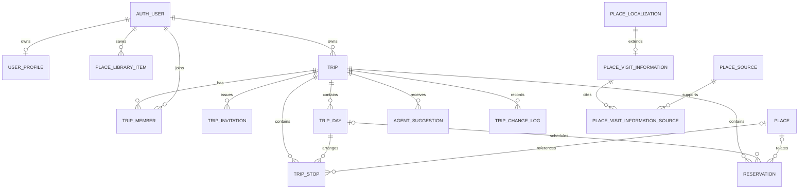
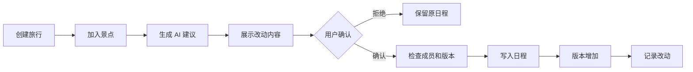

# China Stroll MVP 数据结构与接口契约

## 文档状态

当前版本为 1.0，适用于首个完整开发阶段。主要数据库迁移文件为 `20260827053048_create_mvp_business_schema.sql`，权限与索引修正位于 `20260827053216_harden_mvp_business_schema.sql`。

两次迁移已经应用到项目 `yjguudzllzjdmqsgwtru`。线上 18 张公开表均已启用行级权限，回滚式权限测试通过，Supabase 安全检查没有发现问题。当前性能提示仅涉及新表尚无真实流量，因此暂不删除为外键和常用读取准备的索引。

与线上结构一致的前端类型文件位于 `supabase/database.types.ts`。数据库结构变化后需要重新生成并提交该文件。

本文规定旅行数据的身份、关系、权限和写入方式。景点内容结构继续以《景点数据与 AI 检索方案》为准。

## 设计范围

第一版数据结构支持以下过程。

1. 用户创建北京旅行。
2. 用户收藏产品地点或手动地点。
3. 用户把地点加入某一天，也可以暂时不分配日期。
4. 所有者邀请编辑者或查看者。
5. 成员查看共同日程和预约。
6. AI 根据当前旅行版本提出改动。
7. 用户确认后，Worker 检查权限和版本，再写入新日程。

持续位置共享、公开社区、共同记账和自动读取邮件不进入本结构。

## 数据关系



## 表职责

| 数据表 | 保存内容 | 主要所有者 |
| --- | --- | --- |
| `user_profiles` | 界面语言、内容语言和可选旅行偏好 | 用户本人 |
| `trips` | 目的地、名称、日期、语言、状态、偏好和版本 | 旅行所有者 |
| `trip_members` | 成员角色、成员状态和加入时间 | 旅行 |
| `trip_invitations` | 邀请角色、令牌摘要、有效期和使用次数 | Worker |
| `trip_days` | 日期编号、实际日期、标题和说明 | 旅行 |
| `trip_stops` | 标准地点引用、地点快照、时间、时长、交通和排序 | 旅行 |
| `place_library_items` | 产品收藏和手动地点 | 用户本人 |
| `reservations` | 住宿、交通、餐厅、景点和活动预约 | 旅行 |
| `agent_suggestions` | AI 建议依据、改动列表、风险和确认状态 | 旅行 |
| `trip_change_log` | 写入命令、旅行版本、操作者和改动摘要 | 旅行 |
| `place_visit_information` | 地址、开放时间、票务、预约和入口信息 | 地点内容 |
| `place_visit_information_sources` | 结构化游览信息与来源的关系 | 地点内容 |

## 关键规则

### 地点身份

`places.id` 继续使用当前英文短标识。地图、收藏、日程、预约、导览和 AI 检索统一引用该标识。

`trip_stops` 同时保存地点名称和坐标快照。地点资料更新后，已经确认的日程仍能显示用户加入时看到的信息。手动地点可以没有 `place_id`。

### 旅行成员

旅行创建后，数据库自动为创建者增加一个活跃的所有者成员记录。一个旅行只能有一个活跃所有者。

第一版不支持转让所有权。编辑者可以改日程和预约，查看者只能读取。邀请表只保存令牌摘要，原始邀请令牌不写入数据库。

### 每日安排

`trip_days.day_number` 在同一旅行中唯一。日期允许为空，便于用户先收集地点，再补旅行日期。

`trip_stops.trip_day_id` 允许为空。设置日期后，复合外键保证每日安排与地点属于同一旅行。

### 旅行版本

`trips.version` 从 1 开始。每个写入命令必须携带 `expectedVersion` 和 `commandId`。

Worker 在一个短事务中锁定旅行记录，随后检查成员权限和当前版本。检查通过后执行改动，将版本增加一次，并写入 `trip_change_log`。同一个 `commandId` 重试时返回第一次写入结果。

版本不一致时返回 `VERSION_CONFLICT`，同时返回最新版本。客户端重新读取旅行，旧的 AI 建议随即失效。

### AI 建议

`agent_suggestions.base_version` 保存生成建议时的旅行版本。`changes` 是操作数组，第一版允许以下操作。

| 操作 | 用途 |
| --- | --- |
| `add_stop` | 增加地点 |
| `update_stop` | 修改时间、时长、交通或备注 |
| `move_stop` | 调整日期或顺序 |
| `remove_stop` | 删除地点 |

建议生成后处于 `proposed`。用户可以拒绝。用户确认时，Worker 再检查建议有效期、成员角色和旅行版本。写入成功后状态改为 `applied`，并记录 `result_version`。

`confirmed` 只表示用户已经确认。数据库改动完成后才能进入 `applied`。任何一步失败都保留建议和原因，不能自动重放旧建议。

### 结构化游览信息

`place_visit_information` 保存页面展示和动态推荐需要读取的数据。`opening_hours` 使用 JSON 对象，第一版格式如下。

```json
{
  "timeZone": "Asia/Shanghai",
  "weekly": [
    {
      "days": [1, 2, 3, 4, 5],
      "opens": "08:30",
      "closes": "17:00",
      "lastEntry": "16:00"
    }
  ],
  "exceptions": [
    {
      "date": "2026-10-01",
      "closed": true
    }
  ]
}
```

Worker 负责检查 JSON 格式。开放时间超过 `review_due_at` 后仍可显示原文，但不能作为确定的开放判断。

## 读取与写入权限

| 对象 | 匿名用户 | 登录用户 | Worker |
| --- | --- | --- | --- |
| 已发布景点游览信息 | 读取 | 读取 | 管理 |
| 个人资料 | 无 | 只读写本人 | 管理 |
| 个人收藏 | 无 | 只读写本人 | 管理 |
| 旅行与成员 | 无 | 只读自己参加的旅行 | 管理 |
| 日程、地点和预约 | 无 | 只读自己参加的旅行 | 管理 |
| AI 建议和改动记录 | 无 | 只读自己参加的旅行 | 管理 |
| 邀请令牌摘要 | 无 | 无 | 管理 |

所有公开表启用行级权限。客户端没有旅行表的新增、修改和删除权限。Worker 使用服务端密钥写入，调用前必须验证 Supabase 会话、成员身份和旅行版本。服务端密钥不能进入浏览器、日志或仓库。

## Worker 接口

### 通用请求要求

登录接口使用 Supabase 访问令牌。所有改变旅行的请求携带 `Idempotency-Key`，请求体携带 `expectedVersion`。Worker 将 `Idempotency-Key` 转换为 `commandId`。

返回内容使用 JSON。成功写入返回最新旅行版本。错误使用稳定错误码，页面文案不依赖数据库错误文字。

### 第一批接口

| 方法与路径 | 用途 | 版本要求 |
| --- | --- | --- |
| `POST /v1/trips` | 创建旅行 | 无 |
| `GET /v1/trips/{tripId}` | 读取完整旅行 | 无 |
| `PATCH /v1/trips/{tripId}` | 修改名称、日期和偏好 | 必须 |
| `POST /v1/trips/{tripId}/days` | 增加一天 | 必须 |
| `POST /v1/trips/{tripId}/stops` | 加入地点 | 必须 |
| `PATCH /v1/trips/{tripId}/stops/{stopId}` | 修改地点 | 必须 |
| `DELETE /v1/trips/{tripId}/stops/{stopId}` | 删除地点 | 必须 |
| `POST /v1/trips/{tripId}/invitations` | 创建邀请 | 必须 |
| `POST /v1/trip-invitations/accept` | 接受邀请 | 无 |
| `POST /v1/trips/{tripId}/agent-suggestions` | 生成 AI 建议 | 无写入 |
| `POST /v1/trips/{tripId}/agent-suggestions/{suggestionId}/confirm` | 确认并应用建议 | 必须 |
| `POST /v1/trips/{tripId}/reservations` | 记录预约 | 必须 |

### 写入结果

```json
{
  "tripId": "uuid",
  "version": 4,
  "commandId": "uuid",
  "changed": [
    {
      "type": "trip_stop",
      "id": "uuid"
    }
  ]
}
```

### 错误约定

| HTTP 状态 | 错误码 | 页面处理 |
| --- | --- | --- |
| 400 | `VALIDATION_FAILED` | 标出错误字段 |
| 401 | `UNAUTHENTICATED` | 要求重新登录 |
| 403 | `FORBIDDEN` | 显示没有编辑权限 |
| 404 | `NOT_FOUND` | 返回上一层并刷新 |
| 409 | `VERSION_CONFLICT` | 重新读取旅行并提示变化 |
| 409 | `DUPLICATE_COMMAND` | 使用第一次写入结果 |
| 410 | `SUGGESTION_EXPIRED` | 重新生成建议 |
| 503 | `DEPENDENCY_UNAVAILABLE` | 保留输入并允许重试 |

## 首个完整开发过程

开发顺序固定为以下过程。



这一过程需要覆盖正常写入、重复请求、无权限、版本冲突、建议过期和依赖服务不可用。

## 验证要求

数据库迁移通过以下检查后才能进入业务开发。

1. 新旅行自动生成所有者成员。
2. 所有者和编辑者可以读取旅行。
3. 非成员读不到旅行及子对象。
4. 用户只能读写自己的资料和收藏。
5. 客户端无法直接写旅行表和邀请表。
6. 所有公开业务表启用行级权限。
7. Supabase 安全检查没有错误。
8. 重复命令和版本冲突由 Worker 集成测试验证。

数据库测试脚本位于 `supabase/tests/mvp_business_schema.sql`。脚本在事务中创建临时用户和旅行，检查权限后回滚，不保留测试数据。

## 回退方式

当前迁移只增加空表、索引、函数、触发器和三个地点字段，不修改现有景点内容。若开发前需要回退，先停止 Worker 写入，再按依赖顺序删除新增策略、触发器、函数和表，最后删除 `places` 新增字段。

正式环境已经产生旅行数据后，不执行直接删除式回退。届时应增加兼容迁移，保留已有旅行和改动记录。

## 仍需补充的数据

1. 为首批地点填写地址、开放时间、预约要求和来源关系。
2. 核对现有坐标属于 WGS84、GCJ02 或 BD09，再填写坐标类型。
3. 图片取得授权后写入 `place_media` 并上传 Storage。
4. 选定多语言向量模型后生成检索向量。
