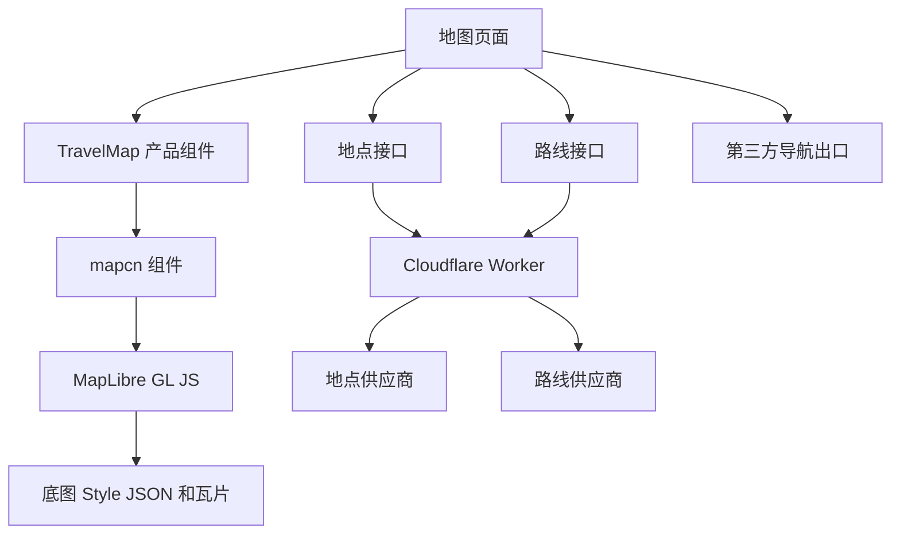

# mapcn 地图实现说明

## 文档信息

本文用于指导 China Stroll 的地图设计、开发、测试和排错。调研日期为 2026 年 8 月 26 日，研究对象为 mapcn 主分支提交 `d5d287d`、mapcn 官方文档、相关 GitHub 问题和 MapLibre 官方文档。

## 采用结论

China Stroll 适合采用 mapcn，但只把它用于地图渲染和地图界面。地点搜索、路线计算、地点标准化、开放时间、AI 推荐和第三方导航继续由产品自己的接口负责。

推荐做法如下。

1. 使用 mapcn 的 `Map`、`MapMarker`、`MarkerContent`、`MapRoute`、`MapClusterLayer` 和 `useMap`。
2. 把 mapcn 源码复制到项目中并记录来源提交，不把它当成不可修改的外部组件包。
3. 产品地图页面再包一层 `TravelMap`，页面和业务代码不能直接依赖 MapLibre 对象。
4. 使用产品自己的底图配置，禁止正式环境使用 mapcn 默认 CARTO 地址。
5. Vite 构建时把 MapLibre Worker 打进应用文件，禁止正式环境从 unpkg 加载 Worker。
6. 第一版不使用 mapcn 的全屏按钮和受控视口，不直接照搬 OSRM 示例中的浏览器请求。

采用 mapcn 后，客户端需要正式使用 Tailwind CSS 和 shadcn 组件约定。若项目仍希望避免 Tailwind 和 shadcn，直接封装 MapLibre GL JS 会更合适。

## mapcn 是什么

mapcn 采用与 shadcn 相近的源码交付方式。安装命令会把地图组件复制进项目，开发者拥有并修改这份代码。它没有单独的地图运行服务，地图渲染由 MapLibre GL JS 执行。

项目当前把主要地图能力集中在一个约 2200 行的 `map.tsx` 文件中。这个文件完成 MapLibre 初始化、主题切换、标记、弹窗、控件、路线、GeoJSON、弧线和聚合点。

截至调研日，GitHub 页面显示约 1.19 万个 Star、698 个 Fork、110 次提交、3 个分支和 0 个 Tag。最近可见提交日期为 2026 年 8 月 16 日。活跃度只能说明项目近期有人维护，不能替代产品适配和真机测试。

mapcn 源码使用 MIT 许可证。地图数据、底图、地点和路线服务仍受各自条款约束。

## 设计思路

mapcn 有四个值得学习的做法。

1. 组件组合

`Map` 提供地图实例和加载状态。标记、弹窗、路线与数据图层作为子组件加入，页面可以用 React 状态控制它们。

2. 保留 MapLibre 入口

常用行为由 React 组件完成，特殊行为可以通过 `useMap` 或 `ref` 访问 MapLibre。产品可以先快速实现，遇到 fitBounds、图层顺序或自定义事件时仍有处理空间。

3. 源码归项目所有

安装后得到可修改源码。我们可以修正定位反馈、Worker 地址和移动端交互，不需要等待上游发布。

4. 底图与界面分开

`styles` 可以接收 MapLibre Style JSON 地址或对象。地图界面不必绑定 mapcn 默认底图。

## 能力与产品用途

| mapcn 能力 | China Stroll 用途 | 第一版决定 |
| --- | --- | --- |
| `Map` | 北京地图、主题、视口和地图实例 | 使用 |
| `MapMarker` | 精选地点、当天行程和用户位置 | 使用 |
| `MarkerContent` | 地点分类、日程序号和选中状态 | 使用 |
| `MarkerLabel` | 当前选中地点的短名称 | 少量使用 |
| `MarkerPopup` | 桌面端简短提示 | 移动端不作为主要详情容器 |
| `MapPopup` | 独立坐标提示 | 按需使用 |
| `MapControls` | 缩放和指南针 | 保留缩放，定位另做 |
| `MapRoute` | 当天路线和候选路线 | 使用 |
| `MapClusterLayer` | 地点较多时聚合 | 地点超过约 80 个后启用 |
| `MapGeoJSON` | 景区范围、步行区域和地理围栏调试 | 后续使用 |
| `MapArc` | 城市间连接效果 | 第一版不用 |
| `useMap` | 移动视口、适配范围和图层控制 | 限定在地图功能内部使用 |

## mapcn 不提供什么

mapcn 不负责以下能力。

1. 地点搜索和地点详情。
2. 步行、驾车和公共交通路线计算。
3. 多地点顺序优化。
4. 北京地点数据纠偏和坐标转换。
5. 开放时间、票务、拥挤度和天气。
6. Apple Maps、Google Maps 和中国本地地图跳转。
7. 地图区域离线下载。
8. 用户位置持续跟踪和后台定位。

官方 OSRM 示例会在浏览器中直接调用公共接口。该示例只用于展示 `MapRoute` 怎样接收坐标，不适合作为正式服务结构。

## 在产品中的系统关系



地图渲染只消费统一地点和统一路线。供应商返回的数据先在 Worker 中转换，随后交给前端。

## 产品数据格式

地图组件只接收产品类型，不能把供应商响应直接传进页面。

```ts
type Coordinate = [longitude: number, latitude: number]

type PlacePin = {
  placeId: string
  position: Coordinate
  name: string
  category: string
  visitState: "saved" | "planned" | "visited"
  dayIndex?: number
}

type RouteResult = {
  routeId: string
  coordinates: Coordinate[]
  distanceMeters: number
  durationSeconds: number
  travelMode: "walk" | "drive" | "transit"
  provider: string
  calculatedAt: string
}
```

内部坐标统一使用经度在前、纬度在后的顺序。数据库保存标准坐标、数据来源和更新时间。接入使用其他坐标体系的中国本地服务时，转换只能发生在服务适配层，并用北京真实地点做误差测试。

## 页面效果与实现

### 北京总览

地图初始显示北京核心城区和首批重点地点。20 至 50 个地点可直接使用 `MapMarker`。每个标记显示类别图形，选中后增大并显示地点名。地图下方始终保留地点列表。

实现状态由页面统一保存。

```ts
type MapSelection = {
  selectedPlaceId: string | null
  hoveredPlaceId: string | null
  visiblePlaceIds: string[]
}
```

用户点地图标记时更新 `selectedPlaceId`，列表滚动到同一地点。用户点列表时，通过 `useMap` 执行 `flyTo`，地图和列表继续使用同一个地点编号。

### 今日行程

当天地点使用带序号的 `MarkerContent`。服务端返回路线坐标后交给 `MapRoute`。候选路线使用较浅颜色，当前选中路线最后渲染并加粗。

路线计算失败时仍显示地点和直线关系提示，页面明确说明路线时间暂时不可用。产品不能把直线距离显示成道路距离。

### 附近地点

一公里、三公里和五公里筛选由地点接口完成。返回结果较少时使用普通标记，结果超过约 80 个时转换为 GeoJSON 并使用 `MapClusterLayer`。点击聚合点后由组件自动放大。

聚合阈值需要用北京重点区域的数据测试。首批只有 20 个地点时无需提前启用聚合。

### 地点详情

手机端点击标记后打开页面底部卡片，显示名称、距离、开放风险、加入行程和导航按钮。地图弹窗只保留短提示，避免弹窗在小屏幕上遮挡地图和操作按钮。

### 当前定位

mapcn 的定位按钮只调用一次浏览器定位，成功后移动地图，失败时只写控制台。China Stroll 需要显示定位中、已拒绝、超时、不可用和定位成功五种状态。

第一版关闭 `MapControls` 自带定位按钮，另写产品定位控件。定位成功后添加一个不可拖动的用户位置标记。用户拒绝定位后，页面提供选择区域和搜索地点的入口。

### 第三方导航

mapcn 不参与导航跳转。导航按钮读取统一地点坐标和名称，再由导航出口生成 Apple Maps、Google Maps 或中国本地地图地址。每种地址都要在北京真机测试。

## 接入步骤

### 第一步　加入组件源码

先配置 Tailwind CSS 和 shadcn，再执行 mapcn 官方安装命令。

```bash
pnpm dlx shadcn@latest add @mapcn/map
```

保存安装日期、上游提交 `d5d287d` 和本地修改说明。后续更新先比较差异，不直接覆盖产品修改。

### 第二步　修正 Vite Worker

mapcn 当前源码默认从 unpkg 加载 MapLibre Worker。China Stroll 使用 Vite，Worker 应随应用构建。

```ts
import * as MapLibreGL from "maplibre-gl"
import maplibreWorkerUrl from "maplibre-gl/dist/maplibre-gl-worker.mjs?worker&url"

MapLibreGL.setWorkerUrl(maplibreWorkerUrl)
```

这段配置放入复制后的地图组件中，替换默认 unpkg 地址。开发和正式构建都要确认 Worker 返回成功，地图加载完成并发出瓦片请求。

### 第三步　配置正式底图

mapcn 默认 CARTO 底图只适合获得相应许可的场景。CARTO 官方说明商业使用需要 Enterprise 许可。正式环境必须提供自己的浅色和深色 Style JSON。

```tsx
<Map
  center={[116.4074, 39.9042]}
  zoom={11}
  styles={{
    light: mapStyles.light,
    dark: mapStyles.dark,
  }}
>
  {children}
</Map>
```

底图选择需要同时检查北京访问速度、中文与英文标注、数据更新时间、商业许可、署名要求、费用和故障处理。若访问令牌必须出现在浏览器中，只使用允许公开且限制来源域名的令牌。

不能把 `tile.openstreetmap.org` 当成正式产品的免费后备服务。OSM 官方瓦片服务没有可用性保证，也禁止批量预取和离线下载。

### 第四步　增加产品组件

建议目录如下。

```text
src/
  components/ui/map.tsx
  features/map/components/travel-map.tsx
  features/map/components/place-marker.tsx
  features/map/components/place-sheet.tsx
  features/map/components/location-control.tsx
  features/map/services/place-client.ts
  features/map/services/route-client.ts
  features/map/services/navigation-links.ts
  features/map/types.ts
```

`components/ui/map.tsx` 保持接近上游源码。地点、路线、定位和导航逻辑放在 `features/map` 中。其他页面只能使用 `TravelMap` 和产品类型。

### 第五步　接入地点和路线

页面向 Cloudflare Worker 请求地点和路线。Worker 负责供应商密钥、超时、错误转换和结果格式。路线接口返回 GeoJSON 坐标、距离和时间，前端只负责展示。

地图移动时不要在每个 `move` 事件立即请求地点。只在用户停止移动后更新可见范围，并增加约 300 毫秒等待。相同范围和筛选条件优先使用已有结果。

## 已知问题和处理决定

| 问题 | 当前证据 | 产品处理 |
| --- | --- | --- |
| Vite 下地图一直加载 | mapcn 问题 74 和 MapLibre v6 文档说明 Worker 配置错误会阻止瓦片加载 | 使用 `?worker&url` 打包 Worker |
| 默认底图商业许可 | mapcn README 和 CARTO 官方说明商业使用需要 Enterprise 许可 | 正式环境强制传入自有 Style JSON |
| 受控视口拒绝移动后不恢复 | mapcn 问题 71 仍然开放 | 第一版不用受控视口锁定，使用 `flyTo` 和 `fitBounds` |
| iPhone 全屏按钮无效 | mapcn 问题 51 仍然开放 | 第一版隐藏全屏按钮，地图页面用普通 CSS 占满屏幕 |
| 定位失败没有页面反馈 | 当前源码只写控制台 | 自建定位控件和状态提示 |
| 主题切换会重载完整 Style | 当前源码使用 `setStyle` 并关闭差异更新 | 路线导航中不提供手动底图切换，切换后验证路线重建 |
| 单文件较大 | 地图组件约 2200 行，问题 11 建议拆分 | 保留上游文件，产品逻辑放在外层，确认出现重复修改后再拆分 |
| 标准 OSM 瓦片不能离线预取 | OSM 官方瓦片政策明确禁止 | 第一版离线只保存行程和内容，不下载地图区域 |

## 第一版实现切片

第一条可开发过程只做一个地图页面。

1. 打开页面后显示故宫、天坛和颐和园三个地点。
2. 点击标记后，列表和底部卡片选中同一地点。
3. 点击列表地点后，地图平滑移动到对应位置。
4. 点击今日路线后，Worker 返回路线并由 `MapRoute` 显示。
5. 点击定位后显示明确状态，拒绝授权时仍可选择区域。
6. 点击导航后打开用户选择的第三方地图。

验收检查如下。

1. Chrome、Safari、Android Chrome 和 iPhone Safari 都能加载地图。
2. Worker 和底图请求没有依赖 unpkg。
3. 地点标记与底图位置在北京真机上没有明显偏移。
4. 列表和地图始终选择同一个 `placeId`。
5. 路线服务失败后地点、列表和导航仍可使用。
6. 拒绝定位、定位超时和浏览器不支持定位都有可见提示。
7. 地图信息可以通过列表访问，颜色和图标都不是唯一提示。
8. 北京移动网络连续测试五分钟，记录地图首屏时间、瓦片失败数、路线时间和定位结果。

## 排错顺序

### 地图一直显示加载中

1. 检查 MapLibre Worker 请求是否成功。
2. 确认使用 `?worker&url`，不能只使用 `?url`。
3. 检查底图 Style JSON 是否返回成功。
4. 检查 Style 中的字体、图标和瓦片地址。
5. 监听 MapLibre `error` 事件并保存资源地址和错误类型。

### 地图空白但控件出现

1. 检查地图容器是否有明确高度。
2. 检查 Style JSON 和瓦片跨域配置。
3. 检查浏览器是否支持 WebGL。
4. 检查令牌来源域名和额度。

### 标记与道路错位

1. 检查经纬度顺序是否写反。
2. 检查地点、底图和路线是否使用同一坐标体系。
3. 用故宫、天坛和景山三个固定点分别比对。
4. 前端样本必须在 `data/coordinate-reviews.json` 中有 WGS84 展示坐标、复核时间和 OSM 对象编号。
5. 图标的底部尖端必须落在坐标点上，不能使用图标外框中心代替锚点。
6. 禁止在 React 组件中零散加入坐标转换。

### 主题切换后路线消失

1. 确认使用调研提交之后的 mapcn 源码。
2. 检查 `style.load` 后路线图层是否重新加入。
3. 确认路线坐标仍保存在 React 状态中。
4. 第一版可固定地图主题，减少旅行途中重载。

### 定位按钮没有反应

1. 确认页面通过 HTTPS 打开。
2. 检查浏览器定位权限。
3. 检查十秒超时是否触发。
4. iPhone 上检查系统定位和 Safari 网站权限。
5. 保留手动选区入口。

## 更新规则

1. 上游更新时先比较 `src/registry/map.tsx`，再选择需要的修复。
2. 每次更新记录上游提交、本地改动和重新测试结果。
3. 不自动覆盖 Worker、底图、定位和产品组件改动。
4. MapLibre 大版本升级前先检查 Worker、ESM、Style 和事件变化。
5. 出现地图问题时先区分组件、MapLibre、底图、地点、路线和浏览器权限，避免一次更换多个部分。
6. 新增景点先在当前底图核对景区中心，再写入坐标审核文件。运行测试确认前端值与审核值一致后才能加入页面。

## 替代方案和失效条件

直接使用 MapLibre GL JS 是主要替代方案。它可以减少一层组件代码，也无需引入 Tailwind 和 shadcn，代价是标记、弹窗、控件、主题与 React 生命周期都要自行处理。

出现以下任一情况时，应停止继续扩展 mapcn，改为直接封装 MapLibre。

1. 产品不采用 Tailwind 和 shadcn。
2. 超过一半地图能力都需要绕过 mapcn 并直接操作 MapLibre。
3. 上游单文件让三个以上功能反复产生冲突。
4. 地图需要大规模动态数据、复杂三维图层或专用离线能力。
5. 受控视口和移动端交互问题连续影响核心过程。

## 关键来源

1. [mapcn GitHub 仓库](https://github.com/AnmolSaini16/mapcn)
2. [mapcn 固定提交源码](https://github.com/AnmolSaini16/mapcn/tree/d5d287dfdb214c349342f30e407a7c6cf81c4e84)
3. [mapcn 安装说明](https://www.mapcn.dev/docs/installation)
4. [mapcn 接口说明](https://www.mapcn.dev/docs/api-reference)
5. [mapcn 地图源码](https://github.com/AnmolSaini16/mapcn/blob/d5d287dfdb214c349342f30e407a7c6cf81c4e84/src/registry/map.tsx)
6. [MapLibre GL JS 安装说明](https://maplibre.org/maplibre-gl-js/docs/)
7. [MapLibre v6 迁移说明](https://maplibre.org/maplibre-gl-js/docs/guides/v5-to-v6-migration-guide/)
8. [mapcn Vite 和 MapLibre v6 问题](https://github.com/AnmolSaini16/mapcn/issues/74)
9. [mapcn 受控视口问题](https://github.com/AnmolSaini16/mapcn/issues/71)
10. [mapcn iPhone 全屏问题](https://github.com/AnmolSaini16/mapcn/issues/51)
11. [CARTO 底图使用说明](https://docs.carto.com/faqs/carto-basemaps)
12. [OpenStreetMap 瓦片使用政策](https://operations.osmfoundation.org/policies/tiles/)

## 最终判断

mapcn 适合帮助 China Stroll 快速做出统一、美观的 React 地图界面。它应停留在地图表现层，产品继续掌握地点身份、路线结果、坐标规则、定位状态和导航出口。

第一版推荐采用 mapcn，并同时确认 Tailwind 与 shadcn。开始开发前先完成三个北京地点、一次路线请求、一次定位请求和两种手机浏览器的最小试验。底图许可、北京网络表现和坐标一致性通过后，再扩大到 20 个重点地点。
