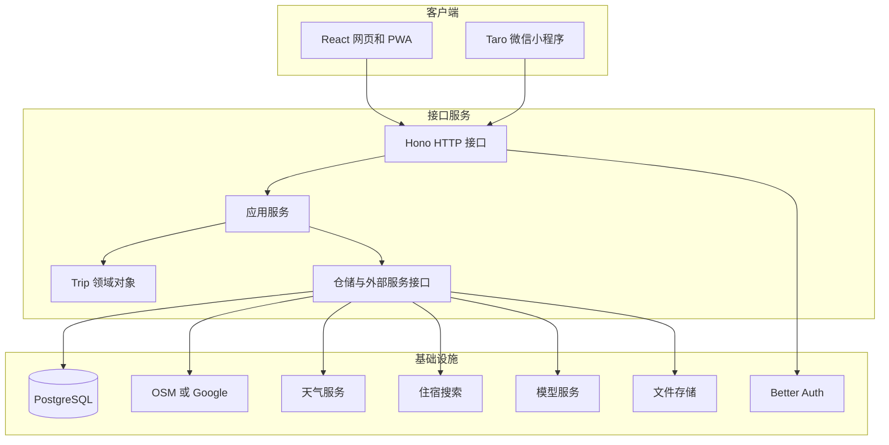
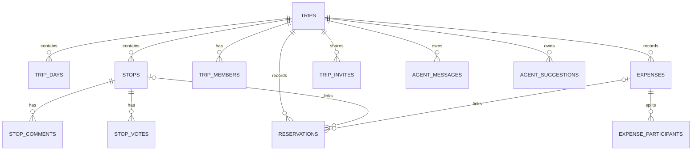
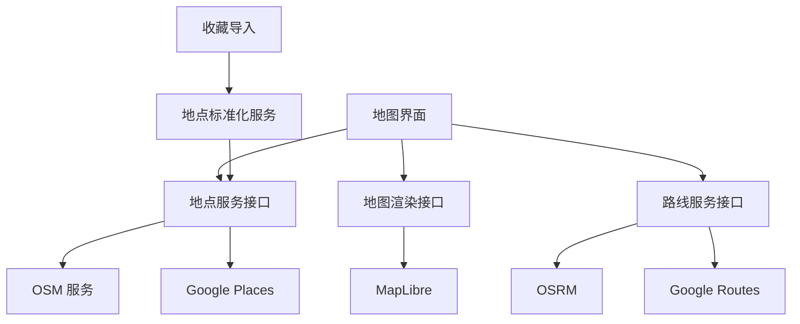

# OpenTrip 项目拆解与 AI 旅游导览产品参考

## 文档状态

本文基于 2026 年 8 月 26 日取得的公开仓库与用户补充材料编写。

OpenTrip 对应提交为 `cfc78a04d0eeba3daaec4b755b110d89938ae4fc`，提交日期为 2026 年 7 月 29 日。

FreeLLMAPI 对应提交为 `e70d1305e112e62b24253728bf07d93e5160ffa4`，提交日期为 2026 年 8 月 25 日。

腾讯内部文章只能取得访问提示，公开搜索也没有找到可核验转载。本文不会依据文章标题猜测其内容。

## 一句话认识 OpenTrip

OpenTrip 是一款面向小团队的协作旅行规划产品。它把地点收集、地图排布、每日行程、预订、共同记账、成员讨论和 AI 建议放进同一个旅行空间。

它解决的是多人旅行中信息散落的问题。群聊适合交流，表格适合记录，地图适合看位置，各自都只能完成一部分工作。OpenTrip 用一个 `Trip` 聚合承接整趟旅行，让成员围绕同一份行程数据协作。

AI 在这里承担研究、检查和提议工作。所有会改动行程的 AI 操作都需要成员批准。这个设计适合旅游产品，因为地点、时间、金额与预订一旦写错，用户会直接受到影响。

## 当前结论

1. OpenTrip 已经超出界面原型范围。仓库包含网页端、微信小程序、后端接口、数据库迁移、部署脚本、文档站与 349 个通过的测试断言。
2. 产品主对象是一次多人旅行。地图、日程、账本、预订、投票、评论与 AI 对话都依附于同一个旅行空间。
3. 项目采用 TypeScript 单体仓库。网页使用 React 和 Vite，接口使用 Hono，业务规则集中在 `Trip` 聚合，PostgreSQL 保存状态。
4. Cloudflare 部署由 Pages、Workers、Hyperdrive、Durable Objects 与 R2 组成。Docker Compose 提供另一种部署方式。
5. 地图展示使用 MapLibre 与 CARTO 底图。普通网页地点搜索直接请求 Photon。AI 地理工具通过统一 `GeoProvider` 接口访问 OSM 或 Google 服务。
6. 用户补图中的多地图适配概念与源码方向相近，源码中的真实接口名是 `GeoProvider`。截图里的 `MapServiceAdapter`、`MapboxAdapter` 与 `OpenStreetMapAdapter` 没有出现在当前仓库。
7. 当前源码没有 Google Maps 收藏点批量导入功能。项目只支持 Google 地点搜索、路线计算和评论读取。收藏点导入需要另建文件解析、预览、去重与批量写入流程。
8. FreeLLMAPI 可以作为 OpenTrip 的 OpenAI 兼容模型入口，但它更适合个人开发、试验或低风险任务。它依赖多个免费额度，模型能力、响应时间和可用量都会变化，不宜直接承担面向付费用户的关键旅游服务。

## 产品定位

### 目标用户

OpenTrip 主要服务两到十人左右的小团队，典型场景包括朋友旅行、家庭出游、结伴自驾和公司活动。

用户需要共同完成几类工作。

1. 收集值得去的地点。
2. 根据距离、营业时间和偏好安排顺序。
3. 记录住宿、交通与活动预订。
4. 讨论取舍并留下决定。
5. 记录共同支出并完成结算。
6. 在旅行中查看当天安排与临时变化。

### 产品对象

OpenTrip 选择了一个很稳妥的产品对象。一次旅行对应一个共享空间，成员进入后看到同一张地图、同一套日程、同一本账和同一段 AI 会话。

这个对象把产品边界定得很清楚。地点属于某次旅行，评论属于某个地点，支出属于某次旅行，AI 建议也绑定旅行版本。权限判断同样围绕旅行成员展开。

### 核心使用过程


## 功能拆解

| 模块 | 用户能做什么 | 主要数据 | 当前完成度 |
| --- | --- | --- | --- |
| 旅行首页 | 查看正在旅行、仍在规划和已经结算的旅行 | `trips` 与成员摘要 | 已实现 |
| 创建旅行 | 填目的地、日期、天数、预算与人数 | `trips.intake` 与日期字段 | 已实现 |
| 地图行程 | 看地点标记、每日颜色与连接路线 | `stops` 与 `trip_days` | 已实现 |
| 日程看板 | 按天查看和编辑地点、时间、时长与交通段 | `trip_days` 与 `stops` | 已实现 |
| 地点详情 | 看备注、媒体、天气、投票和评论 | `stops`、`stop_votes`、`stop_comments` | 已实现 |
| 预订 | 管理住宿、交通和活动订单 | `reservations` | 已实现 |
| 共同账本 | 记录付款人、参与人、金额和币种 | `expenses` 与 `expense_participants` | 已实现 |
| 结算 | 计算每人净额并给出转账方案 | 由账本即时计算 | 已实现 |
| 协作邀请 | 创建邀请链接并分配角色 | `trip_invites` 与成员表 | 已实现 |
| 实时状态 | 同步变更并显示在线成员 | Durable Objects 与 WebSocket | Cloudflare 环境已实现 |
| 行程 AI | 研究地点、天气、路线和住宿 | 行程快照与外部工具结果 | 已实现 |
| AI 写入 | 修改日期、地点、顺序、备注和账本 | 统一操作目录与审批记录 | 已实现 |
| 街景 | 搜索 Mapillary 影像并打开查看器 | 地理坐标与街景候选 | 可配置 |
| 游记 | 在本机编辑 Markdown 游记 | 浏览器本地存储 | 预览状态 |
| Google 收藏导入 | 批量导入用户收藏地点 | 尚无数据模型与接口 | 未实现 |

## 功能设计理念

### 地图和日程共同编辑同一份地点数据

地图擅长回答地点在哪里，日程擅长回答哪天去、几点去、前后怎样衔接。OpenTrip 没有让用户在两套数据间复制内容。地图上的标记和日程里的卡片都来自 `stops`。

每个地点保存所属天数、时间、时长、类别、坐标、费用、备注和排序。用户改变日期或顺序以后，地图和日程都读取新的状态。

这条经验很适合 AI 旅游导览产品。景点卡片、地图标记、路线段和语音讲解应共享一个稳定的地点标识。各页面分别复制地点信息，后面很容易出现名称、坐标和营业状态互相冲突。

### 协作行为靠明确动作完成

OpenTrip 把团队讨论拆成邀请、角色、投票、评论和在线状态。每个动作都落在具体对象上。

地点投票回答成员愿不愿意保留这个点。地点评论保存理由和补充信息。邀请角色控制谁可以编辑。在线状态只告诉成员谁正在查看，不尝试解决同一字段的多人同时编辑。

这种范围控制很实用。项目明确写出它没有采用复杂的多人文本编辑算法。数据库仍是唯一可信状态，WebSocket 只发送变更通知和在线状态。

### AI 保持安静并提供可检查的改动

行程 AI 有三类触发方式。

1. 成员在 AI 面板发起明确对话。
2. 成员在评论或聊天中提到 `@agent`。
3. 一项高风险行程改动完成后，系统让 AI 判断是否需要提醒。

AI 会关注时间冲突、重复地点、天气不合适、路线绕行和账本异常。低置信度发现只写入会话记录，不弹出提醒。达到阈值并带有修改建议时，成员看到提示。

所有写操作都从 `TRIP_OPS` 生成。当前包括旅行改名、增加或删除天数、修改日期、调整天数顺序、增加或修改地点、移动地点、追加备注、增加支出和修改支出。

每项写操作都要求批准。服务端会再次检查成员权限，核对旅行版本，再调用领域方法和仓储。多个成员同时批准同一建议时，第一个成功提交的人获得执行权。

这套设计可以直接用于 AI 导览。AI 可以提出新增地点、调整游览顺序或生成讲解卡片，用户先看清改动内容，再决定是否写入个人行程。

### 预算与结算贴近团队旅行

每笔支出保存付款人和参与分摊的成员。系统累计每人已付金额和应承担金额，再计算净额。结算算法按债务人与债权人的余额逐步匹配，直到大部分余额被清掉。

仓库把金额保存为整数，避免普通浮点金额计算带来的误差。多币种功能目前主要用于展示换算，原始支出仍按录入值保存。

### 创建过程允许信息暂缺

创建旅行时，目的地、日期、天数、预算和人数都可以暂缺。用户完成创建后直接进入规划器。目的地存在时，系统尝试取得封面与地图中心。第一次进入还会生成一条待用户确认的 AI 草稿消息。

这个选择降低了创建门槛。旅游想法常从一个模糊地点或一条收藏开始，强迫用户先补齐所有信息会中断动作。

## 界面补图带来的信息

用户提供的地图截图展示了另一种偏地点收藏的产品形态。左侧是地点列表和分类，右侧是大地图，标记使用地点照片或类别图标。分类包括办公、咖啡、住宿、美食和社群。

这张图与 OpenTrip 的差异很清楚。OpenTrip 以一次旅行和每日顺序组织地点，补图里的产品以长期地点集合和分类组织地点。AI 旅游导览可以兼容两种对象。

1. 地点库保存用户长期收藏，支持 Google 数据导入、分类、标签与去重。
2. 旅行空间从地点库选点，增加日期、时间、交通和团队协作信息。

地点库回答以后想去哪里，旅行空间回答这次怎样去。两个对象应通过地点引用关联，避免把长期收藏直接塞进一次旅行的 `stops` 表。

另一张补图给出了多地图服务适配设想。当前 OpenTrip 代码已经有相近方向。领域层定义 `GeoProvider`，基础设施层提供 `OsmGeoProvider` 和 `GoogleGeoProvider`。两者都能支持地点搜索、附近地点、地点详情、路线和时间矩阵。Google 实现还支持评论，OSM 实现明确返回评论能力不可用。

截图中的 Mapbox 实现目前没有出现在源码。网页底图使用 CARTO，地图渲染使用 MapLibre。地图渲染、地点检索和路线服务是三个独立问题，设计文档应分别描述。

## 技术架构



### 单体仓库结构

| 路径 | 责任 |
| --- | --- |
| `apps/web` | React 网页、PWA、地图与行程规划器 |
| `apps/api` | Hono 接口、领域代码、应用服务与基础设施实现 |
| `apps/miniapp` | Taro 微信小程序客户端 |
| `apps/docs` | Fumadocs 文档站 |
| `packages/agent-ui-catalog` | AI 生成界面的组件目录、校验与流式转换 |
| `packages/observability-contract` | 网页与接口共享的诊断字段 |
| `deploy/cloudflare` | Pages、Workers、Hyperdrive、Durable Objects 与 R2 配置 |
| `deploy/docker` | PostgreSQL、接口和网页容器配置 |
| `docs` | 产品、架构、接口、运维、质量与决策记录 |

### 前端组织

网页端采用 Feature Sliced Design。主要层次包括 `app`、`pages`、`widgets`、`features`、`entities` 和 `shared`。

旅行规划页负责组合地图、日程、账本、预订、地点详情、成员和 AI 面板。接口请求放在 `shared/api`，旅行数据转换放在 `entities/trip`，用户动作由页面模型和功能模块承接。

服务端状态使用 TanStack Query。写请求成功后，客户端直接把返回的新旅行对象写进缓存。项目没有立刻重新请求同一条数据，因为 Hyperdrive 的查询缓存可能在几十秒内返回旧结果。

### 后端组织

后端分为四个部分。

| 层次 | 责任 |
| --- | --- |
| `interfaces/http` | 解析请求、校验输入、调用应用服务、生成响应 |
| `application` | 组织用例、权限检查、事务顺序和外部服务调用 |
| `domain` | 保存旅行、预订、AI 建议和实时消息的业务规则 |
| `infrastructure` | PostgreSQL、模型、地图、天气、文件与运行环境实现 |

`Trip` 是最重要的聚合。投票、评论、地点插入与移动、支出、日期、成员和权限规则都通过它修改。领域代码不依赖 Hono 和 PostgreSQL，因此大部分规则可以快速单测。

### 数据模型



`trips.version` 会在持久化修改后递增。AI 建议保存生成时的旅行版本，批准时若版本已经变化，服务端会拒绝旧建议。

预订使用 `idempotency_key` 防止重复创建，并用 `revision` 配合条件更新处理并发修改。邀请令牌只保存哈希值。用户会话、双因素认证和验证码由 Better Auth 相关表保存。

### 地图实现

OpenTrip 的地图能力分成四块。

| 能力 | 当前实现 |
| --- | --- |
| 地图渲染 | MapLibre GL |
| 明暗底图 | CARTO Positron 与 Dark Matter |
| 网页地点搜索 | 浏览器直接调用 Photon |
| AI 地点与路线工具 | OSM 或 Google `GeoProvider` |

OSM 方案组合 Nominatim、Overpass 与 OSRM。代码对 Nominatim 和 Overpass 做了请求间隔限制，也要求配置可识别的 User Agent。

Google 方案使用 Places API New 与 Routes API v2。它实现文本搜索、附近搜索、地点详情、路线、时间矩阵和评论查询。

地图上的每日路线当前按地点顺序直接连接。AI 可以通过 `routeCompute` 和 `routeMatrix` 获取真实道路距离与用时，但地图展示代码本身没有自动做多点顺序优化。

### 实时协作

Cloudflare 环境为每次旅行创建一个 Durable Object。网页打开规划器后建立 WebSocket。服务端在数据库提交成功后发送带顺序号的变更通知。

通知只说明旅行的哪些范围发生变化，例如地点、日期、支出、成员、预订或评论。客户端收到后更新或重新取得相关状态。Durable Object 不保存第二份业务数据。

连接中断后，客户端可以带上最后一个顺序号请求补发。服务器无法补齐时发送 `resync_required`，客户端重新读取完整旅行。

Docker 运行方式没有同等的 WebSocket 协作实现。需要完整实时体验时，项目文档要求使用 Workers 运行环境。

### AI 实现

OpenTrip 使用 Vercel AI SDK。模型配置来自环境变量，当前支持 OpenAI、带自定义地址的 OpenAI 兼容服务和 MiniMax 的 Anthropic 兼容地址。

```env
AI_PROVIDER=freellmapi
AI_MODEL=auto
AI_BASE_URL=http://localhost:3001/v1
AI_API_KEY=freellmapi-your-unified-key
AI_PROACTIVE_THRESHOLD=0.7
AI_MAX_TOOL_STEPS=16
```

上面的配置说明接口形状可以接入 FreeLLMAPI。正式使用前仍需做一个包含流式输出、工具调用和批准续写的完整试验，因为 OpenTrip 依赖这些能力，单纯通过聊天补全不能证明兼容。

AI 读取工具包括天气、地点搜索、附近地点、地点详情、路线、时间矩阵、评论、Airbnb 搜索和旅行文件读取。写工具来自统一的旅行操作目录。

模型可以返回文本、工具调用和受限的生成界面。生成界面只允许旅行计划卡片、文字、标签、提示、日期摘要、地点摘要、费用估算和按钮等已登记组件。未知组件、任意地址请求、自动动作和过大的界面描述会被拒绝。

### 认证与安全

OpenTrip 使用 Better Auth。网页端使用 Cookie 会话，小程序通过 `wx.login` 换取令牌，再使用 Bearer 方式访问相同业务接口。

安全设计中有几项值得保留。

1. 所有旅行接口都检查登录状态和成员权限。
2. AI 写操作在服务端重新检查权限。
3. AI 批准消息带服务端秘密校验，客户端不能伪造批准。
4. 上传文件限制类型和大小，旅行文件读取只接受本旅行的上传地址。
5. 服务端主动阻止模型下载本机和私网地址，降低 SSRF 风险。
6. 动态接口默认返回 `private, no-store`。
7. Cloudflare 入口缓存明确关闭，防止不同用户的认证响应共用缓存。
8. 认证限速使用 Durable Object，保证同一键的判断集中处理。

### 部署方式

Cloudflare 是功能最完整的部署方式。

| 组件 | 服务 |
| --- | --- |
| 网页与文档 | Cloudflare Pages |
| 接口 | Cloudflare Workers |
| 数据库连接 | Hyperdrive 连接外部 PostgreSQL |
| 实时协作与认证限速 | Durable Objects |
| 图片与附件 | R2 |
| 自动发布 | GitHub Actions |

项目生产说明使用 PlanetScale Postgres 作为外部数据库示例。用户补图中提到每月五美元的 PlanetScale 成本属于用户提供说法，本文没有取得账单或当前价格证明，不把它写成项目固定成本。

Cloudflare 方案也没有天然等于零成本。Pages、Workers、Durable Objects、R2、Hyperdrive、数据库、邮件、地图、天气、街景和模型都可能产生费用。免费额度和价格会变化，开发前应按预计用户量重新计算。

Docker Compose 适合本地开发和自托管。它运行 PostgreSQL、接口服务与静态网页，文件可以放持久卷。实时协作仍需要额外实现或接入 Workers。

## FreeLLMAPI 可以借鉴什么

FreeLLMAPI 是一个本地优先的模型入口。它把多个模型供应商的免费额度接到统一接口，并根据健康状态、速率限制、优先级和历史表现选择模型。请求遇到限流、服务错误或超时时，会尝试下一条可用路线。

它与 OpenTrip 的连接点很简单。OpenTrip 已经支持 OpenAI 兼容地址，FreeLLMAPI 也提供 `/v1` 接口和统一密钥。

### 适合采用的能力

1. 在开发期统一多个模型地址，减少频繁改配置。
2. 为地点摘要、文案改写和非关键研究任务使用备用模型。
3. 用模型档案区分速度优先、能力优先和视觉任务。
4. 记录每个模型的成功率、延迟、额度和错误原因。
5. 在模型不可用前通过健康检查和额度记录跳过故障路线。

### 接入前必须验证的能力

| OpenTrip 需要的能力 | FreeLLMAPI 侧需要验证什么 |
| --- | --- |
| 流式聊天 | 首字节时间、流中断恢复和完整结束事件 |
| 工具调用 | 参数结构、多个工具、工具结果回填和流式工具事件 |
| 结构化结果 | JSON Schema 的遵守程度和失败处理 |
| 图片与文件 | 图片归一化、PDF 处理和请求体上限 |
| 会话连续性 | 发生模型切换后的回答一致性 |
| 审批续写 | 同一会话中工具批准后的继续生成 |
| 可观测性 | 能否取得选中模型、重试轨迹与请求标识 |

### 不宜直接用于正式关键任务的原因

FreeLLMAPI 文档明确说明免费额度没有服务承诺。高能力模型额度通常更少，额度用完后会换到较弱模型。不同供应商的响应时间差异也很大，免费计划可能随时调整。

它还按单用户自托管产品设计，没有多租户计费和隔离。部分供应商条款只允许试验、原型或个人使用。若产品面向公开用户，需要逐家检查服务条款，并为关键请求准备有合同保证的模型服务。

比较稳妥的用法是把模型访问再包一层产品自己的接口。请求先按任务风险分级。地点写入、预订解释和安全提示使用稳定模型，普通文案和低风险摘要可以进入 FreeLLMAPI。无论调用哪个模型，工具权限与业务校验都留在产品服务端。

## Google Maps 收藏点导入设计

当前 OpenTrip 没有这项功能。用户补充的游民地图场景适合作为 AI 旅游导览产品的第一个明确入口，因为用户已经完成了最费时间的地点收集。

### 推荐的数据入口

第一版可支持 Google Takeout 导出的已保存地点文件。开发时需要先取得真实样本，再决定支持的文件类型与字段。Google 导出格式会变化，不能只按一份样本写死解析器。

导入过程可分为六步。


### 推荐数据结构

长期地点库可以增加以下对象。

| 对象 | 关键字段 |
| --- | --- |
| `place_library_items` | 用户、标准地点标识、名称、坐标、地址、来源、来源标识、原始数据 |
| `place_collections` | 用户、集合名称、颜色、可见范围 |
| `place_collection_items` | 集合、地点、排序、个人备注 |
| `place_tags` | 用户、标签名称 |
| `place_import_jobs` | 用户、文件摘要、格式、状态、数量、错误报告 |
| `place_import_rows` | 导入任务、原始行、解析结果、去重结果、处理状态 |

旅行中的 `stops` 可以新增可空的 `library_item_id`。用户把收藏地点加入旅行时，复制当时需要的名称、坐标和备注，同时保留来源引用。以后地点库信息变化时，不应无提示地改动已经排好的旅行。

### 去重规则

去重需要给用户预览，不能静默合并。

1. 来源标识相同可以视为同一地点。
2. 坐标距离很近且标准化名称相似时，可以标成可能重复。
3. 同名但城市不同的地点要保留。
4. 连锁店同名且坐标不同，也要保留。
5. 用户可以选择合并、跳过或分别保存。

### 分类设计

补图中的办公、咖啡、住宿、美食和社群属于长期地点分类。旅行日程还需要景点、交通、购物、活动和自定义分类。

分类应支持用户修改。AI 可以建议分类，但不应在没有确认时覆盖用户的原始收藏标签。

### 地图服务边界

建议沿用 OpenTrip 的接口思想，再把地图渲染与地点数据分开。



这样做可以避免把 MapLibre、Google Places 和 Google Routes 当成一个供应商能力。更换底图不会迫使地点数据和路线服务一起更换。

## 对 AI 旅游导览产品的直接参考

### 建议保留的设计

1. 用旅行空间承接一次出行，用地点库承接长期收藏。
2. 地图、日程和 AI 都使用同一套地点标识与坐标。
3. AI 先研究和提议，用户批准后再写入。
4. 每次 AI 建议绑定旅行版本，旧建议在状态变化后失效。
5. 地图供应商通过接口隔离，业务代码只使用统一地点与路线类型。
6. 实时通道只发变更通知，数据库继续保存可信状态。
7. 预订创建使用幂等键，修改使用版本号。
8. 关键外部能力允许关闭，模型、天气或街景没有配置时，产品仍可使用基础行程功能。

### 需要调整的地方

OpenTrip 偏重行前协作。AI 旅游导览还要处理人在景点附近时的即时任务。

| 导览场景 | 需要新增的能力 |
| --- | --- |
| 到达景点 | 地理围栏、到达判断、自动展示短讲解 |
| 边走边听 | 音频生成、播放进度、耳机和锁屏控制 |
| 看建筑或展品 | 相机输入、视觉识别、可信来源引用 |
| 临时改路线 | 当前定位、开放时间、拥挤度、交通与天气重算 |
| 弱网环境 | 行程、地图区域、文字、图片和音频离线包 |
| 多人同行 | 队员位置授权、集合点、走散提醒和隐私控制 |
| 内容可信度 | 来源、更新时间、事实与传说的标识 |
| 安全提醒 | 风险级别、地区规则、紧急联系方式和人工确认 |

### 推荐的首个产品切片

第一个版本可以聚焦一条完整过程。

1. 用户导入 Google 收藏地点。
2. 系统在地图上展示并建议分类。
3. 用户选择一座城市和旅行日期。
4. AI 根据距离、开放时间和偏好给出两天路线草稿。
5. 用户确认后写入日程。
6. 到达某个地点附近时，产品展示一段有来源的文字讲解。
7. 用户可以调整顺序并重新计算路线。

这条过程同时检验导入、地图、地点标准化、AI 工具、审批写入和现场导览。预订、团队账本、社交分享和复杂音频可放到后续版本。

## 项目风险与局限

### 已确认的限制

1. 游记目前保存在设备本地，没有账号同步和分享权限。
2. 网页地点搜索直接请求 Photon，服务端的 OSM 或 Google 配置不会自动改变这条搜索路径。
3. Docker 方式没有完整实时协作。
4. 普通产品接口没有开放地点删除和支出删除。
5. 预算换汇只改变结算显示，不改变原始金额。
6. 街景依赖 Mapillary 配置，缺少令牌时功能关闭。
7. AI 缺少模型和密钥时，相关接口返回未开放状态，网页隐藏入口。
8. Google 收藏点导入、批量地点管理和长期地点库都未实现。
9. 地图路线展示没有自动多点排序。

### 工程风险

项目同时支持网页、PWA、小程序、Cloudflare、Docker、两种数据库相关路径、多个地图服务和多个模型服务，维护范围已经较大。后续开发应先确定目标运行环境，避免每个功能都同时覆盖所有客户端和部署方式。

Cloudflare 查询缓存曾造成认证响应和旅行数据被错误缓存。仓库已经加入入口缓存禁用、私有响应头、无缓存数据库连接与写回缓存规则。新接口必须沿用这些约束。

AI 同一轮可能并行批准多个写工具。项目用单个内存中的 `Trip` 顺序执行补丁，并按操作合并返回数据。新的 AI 写操作绕过这套机制时，可能让较早的修改从界面消失。

### 证据边界

本次没有使用真实账号登录线上产品，也没有调用付费地图、天气、街景和模型服务。线上部署可用性与第三方密钥配置仍未验证。

腾讯内部文章内容没有读取。用户截图中的自筹资金、Cloudflare 使用方式和 PlanetScale 月成本属于补充说法，不能据此证明当前线上账户状态与费用。

## 本地运行与质量状态

项目要求 Node.js 20 以上、pnpm 和 Docker。仓库建议先运行 `make setup`，它会安装依赖、准备环境文件、启动 PostgreSQL、执行迁移并写入演示数据。随后使用 `make dev` 启动网页和接口。

本次在固定提交上安装依赖并运行测试。直接执行 `pnpm test` 时，两个网页测试文件因缺少 `BASE_URL` 在收集阶段失败。使用下面的测试环境后全部通过。

```bash
BASE_URL=http://localhost:5170 pnpm test
```

通过结果包括 44 个接口测试文件、14 个网页测试文件和两个共享包测试组，共 349 个断言。测试覆盖旅行聚合、结算、邀请、地理服务、街景、预订、实时协议、认证限速、AI 多模态、生成界面和缓存策略等内容。

依赖安装还给出两项环境提示。Prisma 要求更精确的 Node.js 小版本，当前项目根配置只写了 Node.js 20 以上。pnpm 也提示根 `package.json` 中的构建依赖许可字段已经不再从该位置读取。以后升级工具时应修正文档和配置。

## 后续 Skill 可以保存的知识

本次只产出项目说明，没有创建 Skill。后续要把经验整理成 Skill 时，建议把范围限定为 AI 旅游产品设计与实现参考，并保存以下内容。

1. 如何区分长期地点库、一次旅行、每日安排和现场导览。
2. 如何把地图渲染、地点搜索、路线和街景拆成独立接口。
3. 如何设计 AI 读工具、写工具、人工批准和版本失效。
4. 如何处理 Google 收藏导入、格式变化、去重和预览。
5. 如何设计旅游地点的可信来源、更新时间和离线内容。
6. 如何根据任务风险选择模型服务，并保留稳定服务作为关键请求的保障。
7. 如何验证地图、模型、实时协作和第三方接口的真实行为。

Skill 不应复制整个 OpenTrip 项目。它应记录可反复使用的判断方法、接口边界、检查表和小型模板，并附上当前文档作为案例来源。

## 建议继续阅读的源码

| 主题 | 入口 |
| --- | --- |
| 产品范围 | [`docs/project/README.md`](https://github.com/stvlynn/OpenTrip/blob/cfc78a04d0eeba3daaec4b755b110d89938ae4fc/docs/project/README.md) |
| 总体架构 | [`docs/project/architecture.md`](https://github.com/stvlynn/OpenTrip/blob/cfc78a04d0eeba3daaec4b755b110d89938ae4fc/docs/project/architecture.md) |
| 旅行领域对象 | [`apps/api/src/domain/trip/trip.ts`](https://github.com/stvlynn/OpenTrip/blob/cfc78a04d0eeba3daaec4b755b110d89938ae4fc/apps/api/src/domain/trip/trip.ts) |
| AI 说明 | [`docs/backend/agent.md`](https://github.com/stvlynn/OpenTrip/blob/cfc78a04d0eeba3daaec4b755b110d89938ae4fc/docs/backend/agent.md) |
| AI 写操作目录 | [`catalog.ts`](https://github.com/stvlynn/OpenTrip/blob/cfc78a04d0eeba3daaec4b755b110d89938ae4fc/apps/api/src/application/trip/ops/catalog.ts) |
| 地图服务 | [`docs/backend/geo.md`](https://github.com/stvlynn/OpenTrip/blob/cfc78a04d0eeba3daaec4b755b110d89938ae4fc/docs/backend/geo.md) |
| 网页地图 | [`docs/frontend/map.md`](https://github.com/stvlynn/OpenTrip/blob/cfc78a04d0eeba3daaec4b755b110d89938ae4fc/docs/frontend/map.md) |
| 实时协作 | [`docs/backend/realtime.md`](https://github.com/stvlynn/OpenTrip/blob/cfc78a04d0eeba3daaec4b755b110d89938ae4fc/docs/backend/realtime.md) |
| 数据库 | [`schema.prisma`](https://github.com/stvlynn/OpenTrip/blob/cfc78a04d0eeba3daaec4b755b110d89938ae4fc/apps/api/prisma/schema.prisma) |
| Cloudflare 部署 | [`docs/operations/cloudflare.md`](https://github.com/stvlynn/OpenTrip/blob/cfc78a04d0eeba3daaec4b755b110d89938ae4fc/docs/operations/cloudflare.md) |
| 质量要求 | [`docs/quality/README.md`](https://github.com/stvlynn/OpenTrip/blob/cfc78a04d0eeba3daaec4b755b110d89938ae4fc/docs/quality/README.md) |
| FreeLLMAPI 说明 | [`README.md`](https://github.com/tashfeenahmed/freellmapi/blob/e70d1305e112e62b24253728bf07d93e5160ffa4/README.md) |
| FreeLLMAPI 架构 | [`docs/architecture.md`](https://github.com/tashfeenahmed/freellmapi/blob/e70d1305e112e62b24253728bf07d93e5160ffa4/docs/architecture.md) |
| FreeLLMAPI 接口 | [`docs/api.md`](https://github.com/tashfeenahmed/freellmapi/blob/e70d1305e112e62b24253728bf07d93e5160ffa4/docs/api.md) |
| 内部文章访问页 | [OpenTrip 团建神器背后的功能设计理念](https://km.woa.com/articles/show/668439) |

## 最终判断

OpenTrip 最适合借鉴的部分是旅行空间的数据组织方式、地图与日程共用地点状态、受控 AI 写入、版本冲突处理和 Cloudflare 上的实时通知。

如果目标产品更强调 AI 导览，开发重心应从多人账本和复杂预订移到地点库导入、可靠地点资料、路线重算、现场定位、离线内容和有来源的讲解。OpenTrip 可以作为行程协作部分的工程参照，Google 收藏导入与现场导览需要新建领域对象和完整使用过程。
