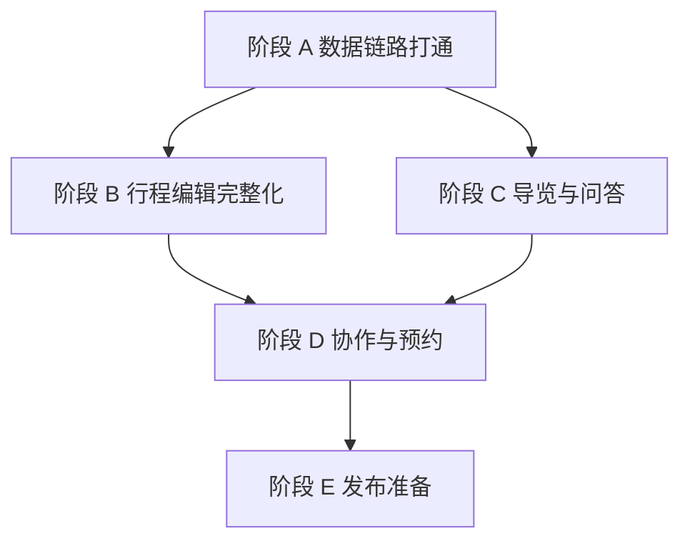

# China Stroll 开发规划

## 文档信息

版本 1.2，创建于 2026 年 8 月 28 日，最近更新于 2026 年 8 月 29 日，当前分支 `main`。

本文承接《迭代版》的产品范围、《MVP 数据结构与接口契约》的写入规则、《景点数据与 AI 检索方案》的内容结构和《mapcn 地图实现说明》的地图边界。这四份文件规定做什么，本文规定按什么顺序做、每一步做完的标准是什么。

范围只覆盖从当前代码到可测试 MVP 的开发路径，也就是《迭代版》第 17.2 节定义的阶段二。阶段三的扩展能力不在本文内。

## 一　代码现状盘点

### 1.1 已经跑通的部分

技术栈已经落地并且线上验证过一轮。React 19、TypeScript、Vite 8、Tailwind 4、PWA 构成前端，Hono 应用同时被 Cloudflare Pages Functions 和独立 Worker 复用，Supabase PostgreSQL 17 承担数据与登录，页面和接口共用 `china-stroll.pages.dev` 单域名。

数据库有 18 张公开表，全部启用行级权限。三个服务端命令函数 `create_mvp_trip`、`apply_mvp_trip_changes`、`confirm_mvp_agent_suggestion` 只授予 `service_role`，浏览器角色没有执行权限。乐观锁通过 `trips.version` 加行锁实现，幂等通过 `trip_change_log.command_id` 查重实现，两条规则都有回滚事务测试覆盖。

前端有一条完整可用的过程。用户进入测试登录或本地预览，创建旅行，把故宫、景山、天坛加入第一天，在列表与地图之间互选同一个地点，取得规则生成的行程建议，确认后写入并让版本加一。地图组件 `TravelMap` 包装 MapLibre，MapLibre Worker 随 Vite 打包，页面不直接接触 MapLibre 对象。

自动化检查有 45 个用例，覆盖共享领域逻辑、接口契约、前端 API 层、登录分支、演示模式、Pages 适配、地点读取和模型配置。数据库另有两份 SQL 测试脚本，在事务里建临时数据、验证后回滚。

### 1.2 已经具备但没接入前端的部分

数据库已有 52 个地点、52 条中文内容、209 个中文导览段落、54 条来源记录、165 条检索文档。账号模式已经通过公开地点接口读取已发布并完成坐标审核的地点，预览模式继续使用三个本地样本。其余地点要完成坐标与内容审核后才会进入列表。

`place_visit_information` 和 `place_visit_information_sources` 两张表结构就位但没有数据，地址、开放时间、票务、预约、入口五类信息还是空的。

### 1.3 明确的技术缺口

按影响程度排序。

| 缺口 | 现状 | 影响 |
| --- | --- | --- |
| 地点来源 | 账号模式已读数据库，预览模式保留三个本地样本 | 仍需审核剩余 17 个首批地点 |
| 接口覆盖 | 契约定义 12 个接口，实现 5 个 | 修改、删除、移动地点，邀请成员，预约记录都无法使用 |
| 改动操作 | 契约定义 4 种操作，前端只用 `update_stop` | 建议只能改时间，不能增删移动 |
| 建议生成 | 通用规则生成器支持任意已审核地点组合，DeepSeek 配置已接入 | 仍需真实密钥调用与结果质量验证 |
| 导览内容 | 无导览页面、无问答接口 | 产品核心价值缺失 |
| 底图 | 直连 `tile.openstreetmap.org` | 许可与北京网络都不满足发布要求 |
| 坐标审核 | 3 个地点已复核，49 个未审核 | 未审核地点不能进入前端 |
| 图片授权 | 58 张本地图片无授权资料，`place_media` 空 | 除三张定制印章图外无可发布图片 |
| 检索向量 | 已确定 `BAAI/bge-m3` 与 1024 维校验，165 条文档仍无向量 | AI 问答仍不能做语义检索 |
| 登录 | 测试模式发匿名会话，无 Turnstile | 不能公开发布 |
| 离线能力 | 只有 PWA 外壳 | 弱网无退路 |
| 实时协作 | Realtime 未接入 | 成员改动互相看不见 |

### 1.4 四处需要在开发中修掉的设计债

第一处，`dayNumber` 在前端 API 层被写死为 1。`api.addStop` 固定传 1，多日行程无法支持。已在 A5 修掉，签名改为可传入天数。

第二处，Worker 的 `userClient` 用 service role key 加用户 Authorization 头构造。service role 会绕过行级权限，这个客户端目前只做读取所以没有暴露问题，但它是一个容易误用的口子。读路径应改成 publishable key 加用户令牌，让行级权限真正生效。新增的公开地点接口已经改用 publishable key，旅行读取路径仍待 D4 处理。

第三处，Worker 的 CORS 只允许 `GET`、`POST`、`OPTIONS`。契约里的 `PATCH` 和 `DELETE` 会被拦掉，实现修改删除接口之前必须先补。已修掉。

第四处，`contracts.ts` 的 `samplePlaceIdSchema` 把合法地点标识写成三值枚举，`addStopSchema` 和 `agentChangeSchema` 都依赖它。地点扩到 20 个后，加入第四个地点会在接口层就被拒绝，报 `VALIDATION_FAILED`。这一处比前三处更隐蔽，因为它不影响读取，只在写入时才暴露。处理方式见 A6。

### 1.5 2026 年 8 月 29 日进度同步

当前五个开发阶段都还没有整段完成。阶段 A 已经完成四项任务，一项完成接口准备，两项尚未开始。阶段 B 和阶段 C 各有一项前置工作完成了一部分。阶段 D 与阶段 E 还没有进入功能开发。

已经完成的规划步骤如下。

1. 首条 MVP 过程已经完成，并在线验证过创建旅行、加入三个地点、生成建议、确认写入和版本增加。
2. A1 已完成。公开地点列表与详情接口已经实现，登录边界已经拆分，公开读取使用行级权限和短时缓存。
3. A4 的主体已完成。账号模式从数据库读取地点，预览模式保留三个本地样本，列表具备加载、失败、无结果和图片缺失状态。
4. A6 已完成。地点标识已经从三值枚举改成格式校验，新地点可以通过接口契约。
5. A7 已完成。新增地点必须处于发布状态并完成 WGS84 坐标审核，数据库回滚测试已经写入仓库。
6. B5 的第一部分已完成。规则建议器可以处理任意已审核地点组合，并按邻近距离、推荐时长、午间休息和当日容量生成 `update_stop` 草案。
7. C4 的模型选择与服务端配置已完成。行程建议可以调用 `deepseek-ai/DeepSeek-V4-Flash`，失败或缺少密钥时回到规则建议。`BAAI/bge-m3` 的 1024 维结果校验已经实现。
8. 模型建议继续经过结构校验、地点范围检查、用户确认和旅行版本检查。模型不能直接完成写入。

尚未完成的部分如下。

1. A2 仍有 17 个首批地点需要坐标审核。
2. A3 的地址、开放时间、票务、预约和入口信息仍待录入并关联来源。
3. A5 只完成了 `dayNumber` 参数，新增日期接口和前端日期选择还没有实现。
4. B5 仍只生成 `update_stop`。`add_stop`、`move_stop`、`remove_stop` 需要等阶段 B 的接口与数据库验证完成后再开放。
5. C4 还没有批量生成 165 条检索向量，也没有完成中英文召回质量测试。
6. C6 只覆盖结构化结果、超时和规则降级。流式输出、工具调用、图片输入、重试记录和请求标识仍待验证。
7. 模型建议尚未使用真实生产密钥完成专项质量验证。

本次检查通过类型检查、代码检查、45 项自动化测试、网页生产构建、Pages Functions 构建和 Worker 预部署构建。数据库 SQL 回滚测试没有在本次检查中重跑，当前环境没有 Supabase 命令行工具。网页构建提示 `TravelMap` 产物约 965 kB，后续应在地图功能继续扩展前安排拆包和首屏性能测试。

下一批开发建议按下面顺序执行。

1. 先完成 A2 与 A3。首批地点的坐标和动态信息会直接决定列表、地图、导览和问答能否使用可信数据。
2. 随后完成 A5。让用户创建第二天并把地点加入指定日期，阶段 A 才能按验收标准结束。
3. 恢复数据库 SQL 回滚测试环境，重跑新增地点门槛、幂等和版本冲突用例，再把阶段 A 标为完成。
4. 阶段 A 通过后开始 B1 至 B4，同时把 B5 扩展到四种操作。每种操作都要继续经过确认、权限、版本和幂等检查。
5. 阶段 B 开发期间可以准备 C4 的真实检索样本和 C6 验证记录，但批量生成向量前要先确认数据审核状态与密钥使用范围。
6. 地图包体拆分、正式底图、Turnstile 和北京网络测试放入发布准备，不要让当前 OSM 试验底图进入公开测试。

## 二　规划原则

四条原则决定了后面的排序。

**先补数据链路，再加功能。** 前端读数据库地点这一步不做完，后面每个功能都要在硬编码常量上重复实现一遍。这是唯一必须最先做的事。

**接口按需实现，不按契约铺满。** 契约里 12 个接口不需要一次写完。每个阶段只实现当前功能需要的那几个，避免写出没有调用方的死代码。

**每个阶段结束时产品可用。** 不允许出现"这个阶段做了一半功能，要等下个阶段才能用"的状态。每个阶段结束都能拿给用户测。

**AI 写入规则不动。** 展示改动、用户确认、服务端校验权限与版本、写入后记录这条链路已经验证过，后续所有功能包括模型接入都复用它，不重新设计。

## 三　阶段划分

五个阶段，从当前代码走到可测试 MVP。

阶段 A 是所有后续工作的前置。阶段 B 和 C 之间没有依赖，可以并行。阶段 D 需要 B 和 C 都完成。阶段 E 收尾。

---

## 阶段 A　数据链路打通

### 目标

前端所有地点数据来自数据库，`samplePlaces` 常量退出业务路径。地点数量从 3 扩到 20。

这是整个规划里优先级最高的阶段，因为它决定了后面每个功能是在真实数据上开发还是在硬编码上开发。

### 任务

**A1　新增地点读取接口**

在 Hono 应用增加两个只读接口。

| 方法与路径 | 用途 | 登录要求 |
| --- | --- | --- |
| `GET /v1/places` | 地点列表，支持语言、类别、时长筛选 | 不需要 |
| `GET /v1/places/{placeId}` | 地点详情，含本地化内容与游览信息 | 不需要 |

这两个接口读已发布内容，匿名可访问，因此不进 `/v1/*` 的登录中间件。当前中间件用 `app.use("/v1/*")` 一把拦住所有路径，需要改成按路径分组，或者把公开读取放在 `/v1/public/*` 前缀下。推荐前者，路径保持干净。

列表接口只返回地图和卡片需要的字段，也就是标识、名称、短介绍、类别、坐标、推荐时长、主图。详情接口再返回历史、看点、提示、实用信息、拍照建议和结构化游览信息。这样列表请求不会拖进整份导览文本。

响应头用 `public, max-age=300` 允许边缘缓存。地点内容变化频率很低，缓存能显著降低数据库压力。

A1 已经完成，实现要点如下。

登录中间件改为按路径分组，`PROTECTED_PREFIXES` 只包含 `/v1/trips` 和 `/v1/trip-invitations`，判断函数是 `requiresAuthentication`。`Cache-Control: private, no-store` 也跟着只加在受保护路径上，公开读取才能真正被边缘缓存。前缀匹配用完整段比较，`/v1/tripsomething` 这类相似路径不会被误判为受保护，也就不会拿到本不该有的登录豁免，这条有测试覆盖。

公开读取用 `SUPABASE_PUBLISHABLE_KEY` 构造客户端，走行级权限。原有的 service role 客户端会绕过行级权限，不适合承担公开读取。这个变量缺失时回退到 service role key 以保证本地开发可用，但线上必须配置，否则公开接口会以 service role 身份读取。

列表接口在数据库查询层面就过滤掉未审核坐标，条件是 `coordinate_system = 'WGS84'` 且 `coordinates_checked_at` 非空且经纬度非空。过滤放在查询里而不是前端，所以未审核的 49 个地点不可能泄漏到前端。

地点标识用 `placeIdSchema` 校验，只接受小写短横线格式，`../../etc/passwd` 这类输入在触库之前就被拒绝。

游览信息返回时带一个 `needsRecheck` 布尔值，由 `isReviewOverdue` 根据 `review_due_at` 计算。缺少复查日期视为过期，前端据此显示待确认提示。

**A2　完成 20 个地点的坐标审核**

从 52 个地点里选出首批 20 个，逐个在 OSM 底图上核对景区边界，写入 WGS84 展示坐标、坐标系标识、OSM 对象编号和复核时间。故宫、景山、天坛已完成，还剩 17 个。

选择标准按《迭代版》第 12.1 节，游客量、文化代表性、路线组合价值、家庭适用性、现场提问潜力五项。

前端有一条自动测试检查每个地点是否有审核记录，这条测试要保留并覆盖新增的 17 个地点。没有审核记录的地点不允许出现在列表接口的返回里，这个过滤放在数据库查询条件里，不放在前端。

**A3　填写结构化游览信息**

为 20 个地点填 `place_visit_information`，包括地址、开放时间原文、结构化开放时间 JSON、票务说明、是否需要预约、预约地址、预约说明、入口说明。每条动态信息通过 `place_visit_information_sources` 关联到 `place_sources`。

开放时间 JSON 格式已经在契约第 113 行定义好，直接用。Worker 侧要加格式校验，避免脏数据进库。

超过 `review_due_at` 的信息仍然展示原文，但界面上要明确标注需要用户自行复查，不能当作确定结论。这条规则同时约束页面展示和后面的 AI 回答。

**A4　前端改造为数据库读取**

`samplePlaces` 从 `packages/shared` 的业务路径移除。保留类型定义，常量本身只留给演示模式和测试夹具使用。

前端新增地点列表状态，加载时调用 `GET /v1/places`。加地点面板从三张固定卡片改成可筛选的列表，筛选维度按《迭代版》第 10.1 节，类别、适合人群、预计时长、预约要求、室内外、步行强度六项。

`refreshSampleCoordinates` 这个给旧预览数据刷坐标的函数在数据库接入后失去意义，可以删掉。

A4 已经完成主体，实现要点如下。

账号模式的地点列表来自 `GET /v1/places`，预览模式仍用 `samplePlaces` 映射成 `PlaceSummary`。这样离线三景点预览不依赖网络，账号模式完全走数据库，两条路径共用同一套渲染代码。

`samplePlaces` 在业务路径上只剩预览模式和图片查找两处引用。`resolvePlaceImage` 用它把地点标识映射到已清版权的三张印章图。

图片缺失有降级方案。`place_media` 目前是空表，58 张本地图片还没有授权资料，所以除三个样本外的地点没有可发布主图。这些地点显示字母占位块，由 `placeInitials` 从英文名生成。不用灰色空白，也不用未授权图片。E6 完成授权后把 `resolvePlaceImage` 换成读 `place_media` 即可。

筛选第一版做了类别和访问时长两项，其余四项要等 A3 把结构化字段填进数据库才有数据可筛。筛选在前端内存里做，因为 20 个地点全量返回只有几 KB，再发一次请求不值得。接口本身支持 `category` 和 `maxDurationMinutes` 参数，将来地点变多可以切到服务端筛选。

四种加载状态都有界面，加载中、失败、筛选无结果、正常列表。失败时明确告诉用户已保存的行程仍然可用，这符合《迭代版》第 10.2 节对服务不可用的要求。

`refreshSampleCoordinates` 暂时保留。浏览器里可能还存着旧的预览行程，删掉这个函数会让那些行程的坐标停在偏移状态。等预览模式重构时再一并处理。

计数芯片从「N / 3 planned」改成「N planned」，因为总数不再固定是 3。

**A5　修掉多日行程的写死值**

`api.addStop` 的 `dayNumber: 1` 改为参数传入。前端界面增加日期选择，用户加地点时能选第几天。`POST /v1/trips/{tripId}/days` 接口实现，允许用户增加一天。

`api.addStop` 的签名已改为 `addStop(accessToken, trip, placeId, dayNumber = 1)`，默认值保持旧行为，调用方可以传入任意天。剩下的前端日期选择界面与 `days` 接口仍待完成。

**A6　放宽地点标识的契约限制**

`contracts.ts` 里的 `samplePlaceIdSchema` 是一个只含三个值的枚举，`addStopSchema` 和 `agentChangeSchema` 都在用它。地点扩到 20 个之后，加入第四个地点会被这个枚举直接拒绝。

改法是换成 `placeIdSchema` 的格式校验，具体标识是否存在交给数据库外键判断。这一步要和 A4 同批完成，否则前端能列出 20 个地点但只能加进去 3 个。

A6 已经完成。`samplePlaceIdSchema` 删除，`addStopSchema` 与 `agentChangeSchema` 改用 `placeIdSchema`，共享类型里 `AgentChange` 的 `placeId` 从三值联合改为 `string`。测试锁定了两个方向，新地点标识可以通过，格式非法的标识仍被拒绝。

**A7　补上 add_stop 的内容与坐标门槛**

放开 A6 的枚举之后发现一个安全缺口。`private.apply_mvp_changes` 的 `add_stop` 分支只按 `places.id` 匹配，不检查发布状态，也不检查坐标复核状态。

在只有三个已审核样本的情况下这个缺口不会暴露，因为接口层的枚举挡在前面。枚举一放开，用户或 AI 建议就可以把未发布内容和未审核坐标的地点写进行程。前者绕过内容审核，后者会让地图落点偏移几百米，正是《迭代版》第 18.8 节要防的问题。

修复方式是在 `add_stop` 的查询里加四个条件，`places.status = 'published'`、`places.coordinate_system = 'WGS84'`、`coordinates_checked_at` 非空、经纬度非空，同时要求 `place_localizations.review_status = 'published'`。查不到就报 `NOT_FOUND place`。

迁移文件是 `20260828055200_restrict_add_stop_to_reviewed_places.sql`。数据库测试在回滚事务里建一个草稿地点，验证三段行为，未发布时被拒、已发布但坐标未审核时仍被拒、补齐坐标审核后才允许加入。

同时给 Worker 的 `mapDatabaseError` 补了 `VALIDATION_FAILED` 分支。原来数据库抛出的 `VALIDATION_FAILED` 会掉进兜底的 503，用户看到的是服务不可用，与实际原因不符。现在正确返回 400。

这条修复必须在 A2 把新地点写进数据库之前应用到线上，否则中间有一段时间存在可写入未审核地点的窗口。

### 验收标准

1. 前端展示的 20 个地点全部来自 `GET /v1/places`，业务代码不引用 `samplePlaces`。
2. 20 个地点都有 WGS84 坐标、OSM 对象编号和复核时间，自动测试覆盖。
3. 20 个地点都有地址、开放时间和票务信息，每条动态信息可以追溯到来源。
4. 缺少开放信息的字段在页面上显示待确认，不显示编造时间。
5. 用户能在三次操作内把一个地点加入指定日期。
6. 地图标记与列表项引用同一个 `placeId`，互相选中。
7. 多日行程可以创建，地点能加到第二天及以后。
8. 类型检查、lint、测试、构建四条命令全部通过。

---

## 阶段 B　行程编辑完整化

### 目标

四种改动操作全部可用，AI 建议不再局限于调整时间。

### 任务

**B1　补齐行程编辑接口**

按契约实现剩余的写入接口。

| 方法与路径 | 对应操作 |
| --- | --- |
| `PATCH /v1/trips/{tripId}` | 修改旅行名称、日期、偏好 |
| `PATCH /v1/trips/{tripId}/stops/{stopId}` | 修改时间、时长、交通、备注 |
| `DELETE /v1/trips/{tripId}/stops/{stopId}` | 删除地点 |

三个接口都走 `apply_mvp_trip_changes`，携带 `expectedVersion` 和 `commandId`，复用现有的权限、版本、幂等检查。

动手之前先改 CORS 的 `allowMethods`，加上 `PATCH` 和 `DELETE`，否则浏览器预检就会失败。

**B2　验证四种操作在数据库侧完整**

`private.apply_mvp_changes` 目前只被 `add_stop` 和 `update_stop` 实际调用过。`move_stop` 和 `remove_stop` 的分支需要单独验证，包括跨天移动时复合外键是否放行、删除后同一天剩余地点的 `sort_order` 是否重排。

验证方式沿用现有做法，先在 `supabase/tests` 的回滚事务里跑通，再应用到线上。

**B3　前端编辑界面**

行程地点支持拖拽排序、改时间、改时长、删除。跨天移动第一版可以用下拉选择日期，不必做跨列拖拽，交互成本太高而收益有限。

每次编辑成功后用返回的新版本更新本地状态。版本冲突时提示用户内容已变化并重新读取旅行，这条分支要有测试覆盖。

**B4　冲突与异常提示**

显示明显的时间冲突和路线异常。第一版判断规则保持简单，同一天两个地点时间重叠、地点在开放时间外、相邻地点距离明显过远三种情况给提示。

距离判断用直线距离配一个宽松阈值，界面上要说清这不是道路距离。这一条和地图虚线的处理方式一致，不把直线当路线。

**B5　建议生成器重写**

`buildSampleSuggestion` 现在写死了三个地点的顺序和三个开始时间，扩到 20 个地点就完全失效。改成通用规则生成器，输入任意地点组合，按地理邻近度排序、按推荐时长分配时间、按开放时间过滤。

输出结构不变，仍然是 `AgentChange[]` 加 `risks[]`。这样后面换成模型时，只替换生成器内部，确认与写入链路一行都不用改。

生成器要能输出 `add_stop`、`move_stop`、`remove_stop`，不只是 `update_stop`。前端建议面板对应展示四类改动的文案，现在的面板只认 `update_stop`，其余一律显示"更新访问顺序"，需要补全。

### 验收标准

1. 四种改动操作在数据库、接口、前端三层全部可用。
2. 修改成功返回新版本，旧版本的建议无法写入。
3. 版本冲突时不执行写入，提示用户重新读取。
4. 无编辑权限的成员写入失败。
5. 重复提交同一 `commandId` 返回第一次结果，不产生第二次改动。
6. 建议生成器在任意地点组合下都能产出结构合法的改动清单。
7. 建议面板准确描述每一类改动的影响范围。

---

## 阶段 C　导览与问答

### 目标

产品的核心价值上线。用户能读到可信的地点讲解，能就地点提问。

### 任务

**C1　导览内容接口**

| 方法与路径 | 用途 |
| --- | --- |
| `GET /v1/places/{placeId}/guide` | 按语言和受众读取导览段落 |

读 `guide_segments`，支持 `locale`、`audience`、`segment_type` 筛选。只返回 `review_status` 为已审核的段落。

响应必须带来源和更新时间。前端展示时把这两项放在显眼位置，这是《迭代版》第 10.2 节的验收条件。

**C2　导览页面**

按《迭代版》第 10.2 节，三十秒简介、三分钟讲解、继续提问三层结构。表达方式支持成人、儿童、简明三种切换，对应 `audience` 字段。

第一版只做文字。音频等 C4 的模型和内容都确定后再考虑，不阻塞本阶段。

内容服务不可用时，已缓存的基础导览仍然可读。这条要在 Service Worker 层做，把已读过的导览段落缓存下来。

页面提供内容报错入口，用户点了之后记录地点标识、段落标识和用户描述。这是《迭代版》第 18.2 节的风险处理手段。

**C3　补齐三份样本的儿童版与常见问题**

故宫、天坛、景山三份英文样本目前只有主讲解，缺儿童版和常见问题。这两类是 `audience` 与 `segment_type` 字段的第一批真实数据，补完才能验证页面的切换逻辑。

按《迭代版》第 12.1 节，每个地点五到十个常见问题。

**C4　嵌入模型选型与向量生成**

165 条检索文档还没有向量。选一个多语言嵌入模型，把模型名称与维度写入 `place_search_documents` 记录，再批量生成向量。

选型和服务端配置已经完成，结论记在《嵌入模型选型与凭据清单》。嵌入使用硅基流动 `BAAI/bge-m3`，代码校验 1024 维结果。对话生成使用 `deepseek-ai/DeepSeek-V4-Flash`。模型密钥只通过 Worker 或 Pages Secret 读取，未进入仓库。真实密钥调用和中英文检索质量仍待专项验证。

选型要实测中英文混合检索质量。测试方式是准备一组真实提问，中英文各若干条，看召回的段落是否相关。52 个地点数据量很小，pgvector 精确扫描够用，不需要提前建复杂索引。

向量维度必须在生成第一条向量之前确认。维度写错要重建 pgvector 列并重新生成全部向量。

**C5　问答接口**

| 方法与路径 | 用途 |
| --- | --- |
| `POST /v1/places/{placeId}/questions` | 就单个地点提问 |

流程按《景点数据与 AI 检索方案》第 89 行的约定。Worker 先按地点、语言、问题类型、当前时间筛选，再从 `place_search_documents` 取少量相关段落，把段落、来源、更新时间一起交给模型，模型基于这些内容生成回答。

模型不能直接读整张表，这是硬约束。

回答必须标出依据和更新时间。动态信息过期时回答要提示用户再次确认，不给确定结论。开放时间、价格、历史事实三类内容不允许编造，缺少依据时明确说不知道。

**C6　模型接入前的专项验证**

按《迭代版》第 11.5 节，接模型之前先单独验证流式输出、工具调用、结构化结果、图片输入、超时处理、重试轨迹、请求标识七项。普通聊天测试不能证明模型能支撑行程 Agent。

这一步的产出是一份验证记录，写进 references 目录，而不是直接开始写业务代码。

模型服务放在产品自己的抽象层后面，业务代码不直接依赖某个供应商。关键行程改动和安全提示只用验证过的稳定服务，免费或预览模型只在开发和低风险内容上用。

### 验收标准

1. 20 个地点都能打开导览，回答标明依据和更新时间。
2. 三种表达方式切换后内容对应变化。
3. 内容服务不可用时已缓存导览仍可阅读。
4. 用户能报告错误内容，报告可追溯到具体段落。
5. 问答不编造开放时间、价格和历史事实。
6. AI 只返回已发布内容。
7. 中英文检索质量通过实测。
8. 模型能力验证记录归档在 references 目录。

---

## 阶段 D　协作与预约

### 目标

家庭共享场景成立。多个成员看同一份日程，能记录预约。

### 任务

**D1　成员邀请**

| 方法与路径 | 用途 |
| --- | --- |
| `POST /v1/trips/{tripId}/invitations` | 创建邀请 |
| `POST /v1/trip-invitations/accept` | 接受邀请 |

邀请表只存令牌摘要，原始令牌不落库，这条在契约里已经定好。令牌有有效期和使用次数上限。

第一版不支持转让所有权。编辑者能改日程和预约，查看者只读。

《迭代版》第 19 节第 2 条还没有定论，同行成员是愿意注册还是更接受带有效期的只读链接。这一步开发时两种都留出可能，先做注册式邀请，把只读链接作为待验证选项。

**D2　预约记录**

| 方法与路径 | 用途 |
| --- | --- |
| `POST /v1/trips/{tripId}/reservations` | 记录预约 |

住宿、交通、餐厅、景点、活动五类。预约可以关联标准地点和行程地点。

三条验收条件按《迭代版》第 10.7 节。重复提交不产生两条相同预约，靠 `commandId` 幂等实现。订单号等敏感信息用户可以隐藏。删除预约不删关联的地点和日程。

**D3　Realtime 通知**

接 Supabase Realtime，一个成员改动后其他在线成员收到提示。第一版只做提示加刷新，不做实时增量合并，复杂多人同时编辑在《迭代版》第 15.2 节明确暂缓。

接入前先做小型专项试验，验证 Realtime 在行级权限下的订阅行为是否符合预期。

**D4　修掉 userClient 的权限设计**

把读路径的 Supabase 客户端从 service role key 改成 publishable key 加用户令牌，让行级权限在读取路径上真正生效。

这一条在多成员场景下从"容易误用"变成"必须修"，因为读取隔离直接关系到成员之间的数据边界。改完后要重新跑一遍非成员隔离测试。

**D5　离线基础能力**

按《迭代版》第 13.2 节，当天行程和重点内容支持基础离线。无网络时能看最近保存的当天安排，恢复网络后重新同步。

Service Worker 缓存策略分两类。地点内容和导览段落用 stale-while-revalidate，变化慢。行程数据用 network-first 配本地兜底，变化快且要求准确。

写操作在离线时不排队重放。旧的写入命令在网络恢复后可能已经和最新版本冲突，直接重放会绕过版本检查。正确做法是提示用户重新操作。

### 验收标准

1. 所有者能邀请成员，成员按角色获得对应权限。
2. 非成员读不到旅行及其子对象。
3. 查看者无法写入。
4. 两名成员先后修改时，后进入页面的成员看到最新状态。
5. 在线成员能收到其他成员的改动提示。
6. 重复提交预约不产生两条记录。
7. 无网络时能查看最近保存的当天安排。
8. 读取路径依赖行级权限，不依赖 service role 绕过。

---

## 阶段 E　发布准备

### 目标

从私有测试转为可以邀请外部用户的状态。

### 任务

**E1　关闭测试登录**

按《MVP 首条功能开发记录》第 54 行，加 Turnstile，关闭 `VITE_ENABLE_TEST_LOGIN`，恢复正式邮件登录。

邮件发送限额是当初改成匿名会话的原因，恢复正式登录之前要先确认发送方案，是提额还是换服务商。

清理遗留的匿名测试账号。

**E2　正式底图**

当前 `TravelMap` 直连 `tile.openstreetmap.org`，这既不符合 OSM 的使用政策也没做北京网络验证。

按《mapcn 地图实现说明》第 201 行选定符合许可、署名和北京访问要求的 Style JSON。不用 mapcn 默认的 CARTO 地址，也不把标准 OSM 瓦片当作产品后备。

底图切换后重新验证故宫、天坛、景山三处标记没有明显偏移。

**E3　地图能力补齐**

按《迭代版》第 10.3 节补三项。当前定位用产品自己的控件和状态提示，用户拒绝定位后仍能选地点或搜索区域。附近地点支持一公里、三公里、五公里筛选。第三方导航支持跳转 Apple Maps、Google Maps 和可用的中国本地地图。

真机跳转效果是《迭代版》第 19 节第 7 条的待决定事项，要在北京真机上实测。

**E4　接下来去哪**

按《迭代版》第 10.5 节。从当前地点或用户选择的位置出发，支持历史、用餐、休息、拍照、亲子、回酒店六类意图，返回两到四个选择。

每个结果展示距离、预计时间和推荐理由。已闭馆或无法确认开放状态的地点不能作为无风险首选。加入日程前展示会被移动或删除的项目。用户拒绝后原日程不变。

这个功能依赖 A3 的开放时间数据和 C4 的检索能力，所以放在最后。

**E5　旅行工具**

按《迭代版》第 10.6 节。支付说明、汇率换算、常用语句和大字模式、中英翻译、紧急信息五项。

汇率要显示数据时间和来源。翻译历史默认只存本机，用户可清除。紧急信息在 AI 不可用时仍可查看，也就是说这部分内容要打进静态包。

**E6　图片授权**

58 张本地图片补齐来源、授权范围和署名方式。替换 28 张低清图和 2 张带水印图。授权确认后写入 `place_media` 并上传 Supabase Storage。

没有授权资料的图片不进正式环境，这条不放宽。

**E7　北京网络真机测试**

按《迭代版》第 21 节第 10 条，在北京移动网络上实测 Pages 同域接口、Supabase、底图、地点服务、路线服务。记录失败次数、地图首屏时间、瓦片失败数和高位响应时间。核心请求不能连续失败，高位响应时间不超过两秒。

**E8　可访问性与性能**

按《迭代版》第 13.3 和 13.5 节。地图信息同时提供列表形式，主要功能支持键盘操作和清楚焦点，图标和颜色不单独承担地点类别、选中状态和日程状态的含义。

390 像素宽度不出现水平溢出，这条现在已经满足，后续每个界面改动都要保持。

**E9　隐私说明**

覆盖定位、同行成员、宗教和饮食偏好四类。按《迭代版》第 13.4 和 6.7 节，少收集敏感信息。

### 验收标准

1. 正式登录恢复，Turnstile 生效，测试登录关闭。
2. 底图符合许可与署名要求，通过北京网络验证。
3. 用户拒绝定位后核心功能仍可用。
4. 路线服务失败后地点、列表和第三方导航仍可用。
5. 接下来去哪的每个结果都有距离、时间和理由。
6. 紧急信息在 AI 不可用时可查看。
7. 正式环境的图片全部有授权与署名。
8. 北京网络下核心请求无连续失败，高位响应时间不超过两秒。
9. 主要功能支持键盘操作。
10. 隐私说明覆盖四类敏感信息。

---

## 四　贯穿全程的质量要求

### 4.1 每个阶段都要满足

四条检查命令必须全绿，类型检查、lint、测试、构建。

新功能要覆盖正常路径、无权限、版本冲突、依赖服务不可用四种情况。这是契约第 222 行的要求，不是可选项。

数据库改动先在 `supabase/tests` 的回滚事务里验证，再应用到线上。这个做法在坐标修正和级联删除两次改动上都生效过，继续保持。

### 4.2 三条不可退让的门槛

按《迭代版》第 16.3 节。

核心地点事实错误为零。未经确认的 AI 行程写入为零。无权限成员修改成功为零。

这三条任何一条破了，对应功能不能发布。

### 4.3 分支与提交

`wb-code` 的五个阶段提交和模型配置已经在 `codex/integrate-models` 汇合。每个后续任务继续使用独立提交，阶段完成并通过检查后合回 `main`。

数据库迁移文件与代码同一个提交，避免结构和代码不同步。`supabase/database.types.ts` 在结构变化后重新生成并提交。

## 五　并行安排

阶段 A 必须单独完成，它是所有后续工作的前置。

A 之后 B 和 C 可以并行，两者没有代码耦合。B 集中在行程写入路径，C 集中在内容读取路径和模型接入。

C4 的嵌入模型选型和 C6 的模型能力验证都是可以提前启动的独立调研，不占用编码时间，建议在阶段 A 期间就并行开始。

E2 的底图选型、E6 的图片授权、E7 的北京网络测试同样可以提前启动。这三项都涉及外部依赖和沟通周期，越早开始越不会在最后卡住发布。

## 六　需要在开发中拿到答案的问题

《迭代版》第 19 节列了 8 项待决定事项。其中 4 项会直接影响开发实现，列在这里。

**同行成员的邀请方式。** 注册式还是有效期只读链接。影响 D1 的实现。开发时先做注册式，把只读链接留作可切换选项。

**大型地点是否拆成内部展项。** 故宫、天坛、长城这类地点内部还有多个展项。影响 A2 的地点身份设计和 A4 的列表结构。建议在 A2 选定 20 个地点时一并定下来，拆分会影响 `places` 表的记录粒度，后改成本很高。

**是否允许免登录创建本地旅行。** 现在有预览模式但和账号旅行是两套数据。影响 A4 和 E1。如果要支持，需要设计本地旅行向账号旅行的迁移路径。

**音频的制作方式。** 真人录制、语音合成还是混合。影响 C2 的范围。第一版只做文字，这个问题可以推到阶段二之后。

## 七　与已有文档的关系

| 文档 | 关系 |
| --- | --- |
| 迭代版 | 产品范围与验收条件的来源，本文不重复定义功能 |
| MVP 数据结构与接口契约 | 数据关系与写入规则的来源，本文只补充新增接口 |
| 景点数据与 AI 检索方案 | 内容表结构与检索方式的来源，阶段 C 直接依据 |
| 景点来源与图片审核 | 图片与来源现状的来源，E6 直接依据 |
| mapcn 地图实现说明 | 地图边界与接入步骤的来源，E2 与 E3 直接依据 |
| MVP 首条功能开发记录 | 当前进度的来源，本文第一节在此基础上补充代码盘点 |

本文的阶段划分与《迭代版》第 17 节的阶段计划对应关系是，阶段一已经完成，本文的 A 到 E 五个阶段合起来构成《迭代版》的阶段二。

## 八　文档维护

每个阶段完成后更新本文，记录实际完成情况和与计划的偏差。

如果开发中发现某项规划不合理，在本文中说明原因和调整后的方案，不要静默改变做法。这条规则的目的是让后来接手的人能看懂为什么最终实现和最初计划不同。
