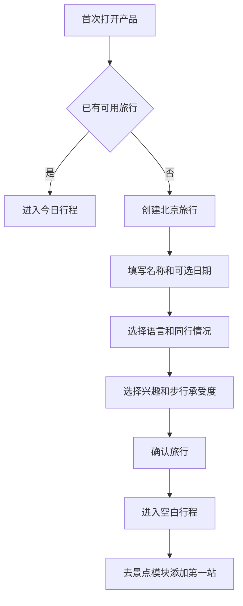
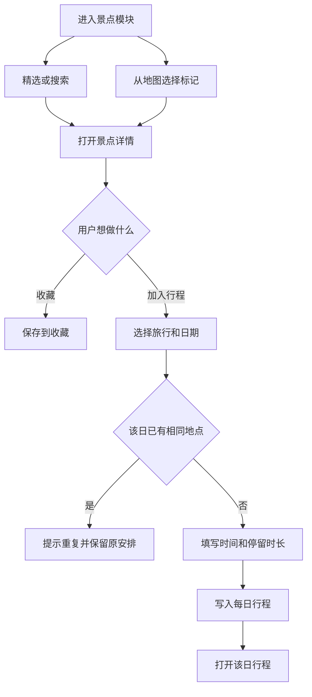
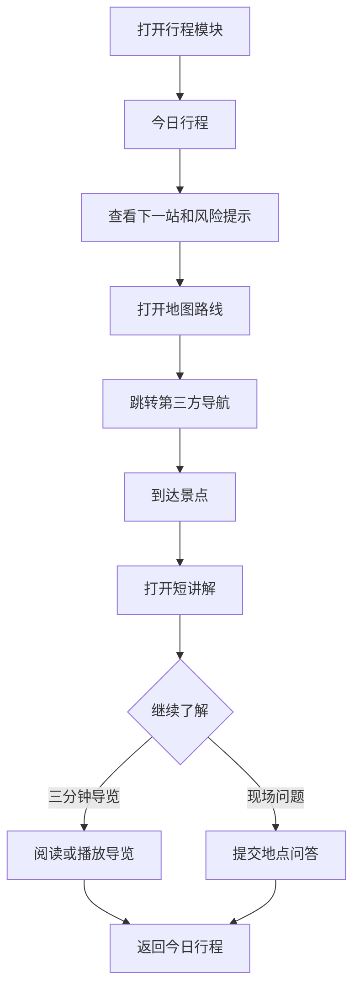
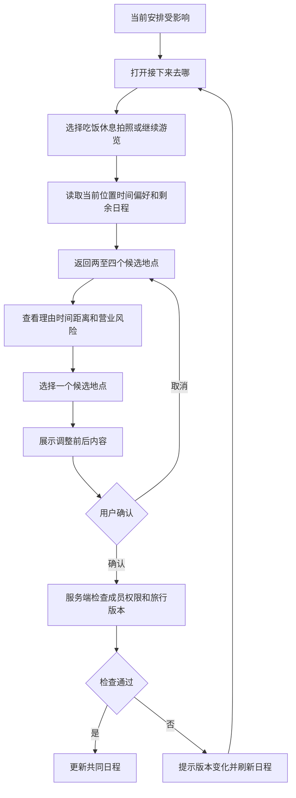
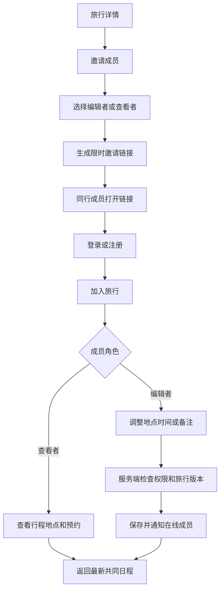
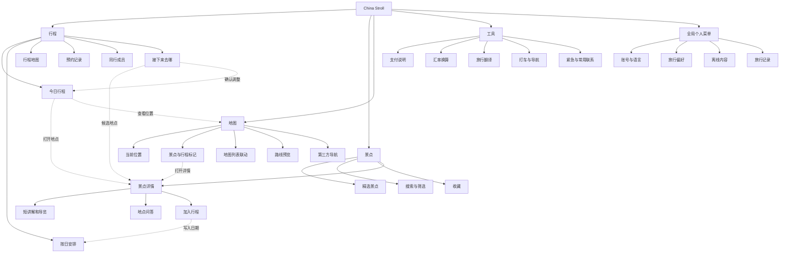
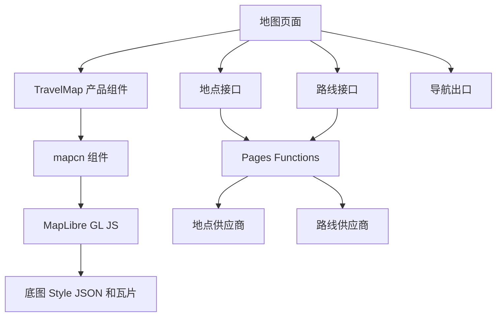
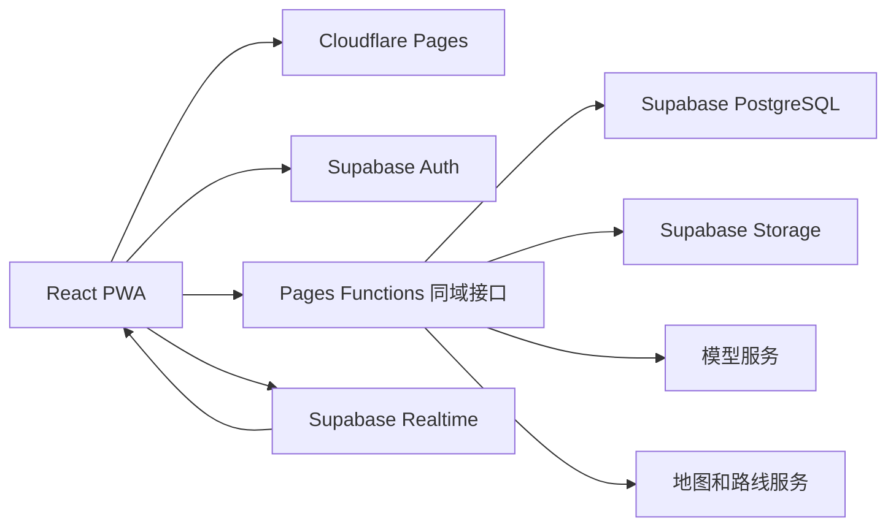

# 北京 AI 旅行导览产品 PRD

## 文档信息

产品代号为 China Stroll，当前版本为 1.0，更新时间为 2026 年 8 月 27 日。文档处于开发前验证阶段，适用于产品设计、原型、内容准备、技术验证和第一版开发。

依据材料

1. [目标市场和用户研究](./目标市场+用户研究.md)
2. [OpenTrip 项目拆解](./opentrip-project-analysis.md)
3. [竞品调研](./竞品调研.md)
4. [mapcn 地图实现说明](./mapcn-地图实现说明.md)
5. [景点来源与图片审核](./景点来源与图片审核.md)
6. [MVP 数据结构与接口契约](./MVP数据结构与接口契约.md)
7. [MVP 首条功能开发记录](./MVP首条功能开发记录.md)

本文是当前项目的产品主文档。后续设计和开发出现冲突时，应先回到本文确认产品范围，再记录新的决定。

## 当前结论

1. 产品先服务来北京自由行或半自由行的海外家庭及朋友小团体。
2. 首批验证市场选择澳大利亚和马来西亚，新加坡作为低本地化成本的补充验证市场。
3. 第一版使用英语，优先满足家庭中的行程组织者，同时照顾老人、儿童和同行成员。
4. 产品重点放在旅行中。用户需要随时理解眼前地点、决定下一站、查看共同安排，并处理支付、导航和沟通问题。
5. 一次旅行是协作和行程的主对象，标准地点是地图、景点详情、日程和 AI 共用的基础对象。
6. AI 负责解释、研究、比较、检查和提出改动。涉及行程的改动必须先展示内容，再由用户确认。
7. 第一版采用手机优先的 Web 和 PWA。持续位置共享、社区、共同记账和自动导入预约放到后续阶段。
8. 技术方案采用 React、Vite、Cloudflare Pages、Pages Functions 和 Supabase。页面与业务接口共用 Pages 域名。
9. 地图采用 mapcn 和 MapLibre GL JS。mapcn 只处理地图界面，地点、路线、坐标、定位状态和导航出口由产品自己的模块负责。
10. 第一版底部导航使用行程、景点、地图和工具。行程是默认首页，个人设置放在全局菜单。
11. MVP 业务数据使用用户、旅行、成员、邀请、每日安排、行程地点、收藏、预约、AI 建议和改动记录。旅行写入携带预期版本与命令标识，由 Worker 检查后执行。

## 一　产品背景

海外游客来北京前通常会在 Google 搜索、社交媒体、地图和 OTA 之间收集信息。到达中国后，他们又会遇到一套不同的地图、支付、打车、预约和语言环境。

现有产品可以分别解决路线、评论、订票或翻译。用户仍需自己判断哪些信息可信，怎样把地点排进当天安排，临时改变计划后还能去哪里，以及怎样让同行家人知道最新安排。

China Stroll 把北京地点内容、地图、共同日程、现场导览和来华旅行工具放进一次旅行空间。用户旅行前可以收集和安排，旅行中可以理解现场并调整下一站，旅行后可以保留自己的记录。

## 二　目标市场

### 2.1 首批市场

澳大利亚是第一优先市场。

1. 北京游客增长较快。
2. 英语内容可以直接覆盖。
3. 家庭与多代旅行需求明显。
4. 用户重视文化和教育型旅行，北京的核心内容供给与此匹配。
5. 消费能力和自由行能力较强，适合验证付费意愿。

马来西亚是第二优先市场。

1. 在东南亚候选市场中，北京现有游客量较大。
2. 家庭和多人旅行需求强。
3. 英语可以覆盖第一批种子用户。
4. 清真饮食、礼拜和多族群文化解释能形成清楚的产品特色。
5. 中国地图、支付和语言环境带来的使用困难更突出。

新加坡作为补充验证市场。

1. 英语覆盖成本低。
2. AI 接受度高。
3. 自由行能力强。
4. 市场体量较小，不单独承担第一阶段增长目标。

### 2.2 暂缓市场

1. 美国游客规模大，但当前增长和普通游客入境便利度相对弱，可在英语版本稳定后进入。
2. 加拿大增长较快，可与澳大利亚共用大部分英语内容，适合第二批投放。
3. 印尼、越南和泰国有增长潜力，但语言、支付习惯和本地传播渠道需要额外投入，第一版不单独适配。

## 三　目标用户

### 3.1 核心用户

家庭行程组织者

典型年龄为 30 至 45 岁。他负责查资料、订酒店和门票、安排餐厅、照顾同行成员，并在计划变化时作决定。

他的主要目标

1. 少在多个应用之间来回查找。
2. 把全家的地点、预约和每日安排放在一起。
3. 随时知道当天安排是否可行。
4. 为老人、儿童、饮食限制和体力差异调整路线。
5. 让同行成员看到最新安排。

### 3.2 重要同行用户

多代家庭成员

1. 需要少步行、休息点、厕所和容易理解的集合信息。
2. 需要儿童版和成人版的文化解释。
3. 需要快速看到今天去哪里和下一次集合时间。

年轻文化探索者

1. 从 TikTok、Instagram、YouTube 或朋友推荐发现地点。
2. 到现场后希望继续提问。
3. 关心拍照点、本地故事、美食和临时路线。

### 3.3 第一版默认画像

第一版的默认测试用户是一名英语使用者，带两至五名家人或朋友来北京旅行三至七天。他已经订好机票和住宿，保存了一部分想去的地点，对北京文化有兴趣，也担心地图、支付、预约和语言问题。

### 3.4 关键信任偏好

用户的旅行判断通常来自搜索结果、地图评分、社交媒体、OTA、当地人和同文化背景游客。AI 回答需要说明信息来源和更新时间。地点经验要区分官方信息、本地建议、游客经验和 AI 整理内容。

## 四　用户问题

### 4.1 旅行前

1. 想去的地点散落在地图收藏、短视频和聊天记录中。
2. 不知道北京各地点之间的真实距离和合理顺序。
3. 不清楚哪些地点需要预约，预约信息也容易散落。
4. 家庭成员的兴趣、体力和饮食要求不同。

### 4.2 旅行中

1. 到了现场仍不明白建筑、文物和习俗的含义。
2. 原计划受天气、排队、疲劳、闭馆或交通影响后，不知道下一站怎样改。
3. 同行成员看不到最新安排，临时变化需要反复在群聊解释。
4. 支付、打车、导航、菜单和现场沟通都可能中断旅行。
5. 地图和路线在弱网环境下可能失效。

### 4.3 旅行后

1. 照片与地点没有关联。
2. 旅行记录散落在相册和聊天中。
3. 已经确认有价值，但第一版不以旅行后分享为重点。

## 五　产品定义

China Stroll 是面向海外游客的北京 AI 在地旅行助手。它以一次旅行和标准地点为基础，通过可信导览、附近推荐、共同日程、地图和来华工具，帮助用户发现北京、理解现场并决定下一站。

产品承诺

1. 用户打开产品后能快速知道今天去哪和附近有什么。
2. 用户到达重点地点后能获得简短、可信、适合自己的解释。
3. 计划变化后，用户能在几分钟内得到可执行的下一站建议。
4. 同行成员能查看同一份最新日程。
5. AI 不会在用户不知情时修改行程。

## 六　产品原则

### 6.1 旅行中优先

页面和推荐优先使用当前位置、当前时间、当天日程和用户状态。完整行程生成可以提供，但不能遮住现场导览和临时调整。

### 6.2 一个地点身份

景点卡片、地图标记、行程项目、预约和导览内容都引用同一个标准地点。旅行日程保存当时使用的名称、坐标和备注，避免地点资料更新后悄悄改动已排好的行程。

### 6.3 一次旅行一个共享空间

成员围绕同一份旅行数据查看日程、地点、预约和 AI 建议。数据库保存可信状态，实时连接只发送变更通知和在线状态。

### 6.4 AI 改动需要确认

AI 可以提出新增地点、调整顺序、修改时间或补充备注。界面先展示改动前后内容。用户确认后，服务端再次检查权限和旅行版本，再执行写入。

### 6.5 有来源才能讲解

重点景点内容由人工整理和审核。动态回答应引用可靠资料，并标明更新时间。事实、传说和游客经验需要分开表达。无法确认的开放时间、票价或预约状态不应写成确定结论。

### 6.6 基础功能可以独立使用

模型、天气、街景或某个地图服务暂时不可用时，用户仍能查看已经保存的行程、地点资料和基础地图。

### 6.7 少收集敏感信息

国家、语言、饮食限制、宗教偏好和同行关系都由用户主动填写。用户可以不保存。位置权限按使用场景申请，并清楚说明用途和停止方式。

## 七　产品对象

### 7.1 标准地点 Place

标准地点保存稳定地点身份、名称、别名、坐标、地址、类别和外部来源标识。北京核心景点还关联人工内容、图片、开放信息和可信来源。

### 7.2 地点收藏 Place Library Item

地点收藏属于个人，保存来源、个人备注、集合和标签。后续可支持 Google Takeout 导入。第一版先支持产品内收藏和手动添加。

### 7.3 旅行 Trip

旅行保存目的地、日期、语言、成员、偏好和当前版本。日期和人数可以暂缺，用户仍可先创建旅行并收集地点。

### 7.4 每日安排 Trip Day

每日安排保存日期、标题、当天说明和地点顺序。

### 7.5 行程地点 Stop

行程地点引用标准地点，也保存进入行程时的名称、坐标、所属日期、开始时间、预计时长、类别、交通方式、备注和排序。

### 7.6 预约 Reservation

预约保存住宿、交通、餐厅、景点或活动的时间、状态、订单信息和关联地点。第一版支持手动记录，图片和邮件自动提取放到后续阶段。

### 7.7 导览内容 Guide Content

导览内容保存语言、适用人群、地点或展项、正文、音频、来源、审核状态和更新时间。

### 7.8 AI 建议 Agent Suggestion

AI 建议保存旅行版本、建议原因、改动清单、风险提示、状态、发起者和确认者。旅行数据变化后，旧建议自动失效并要求重新生成。

### 7.9 旅行记录 Record

旅行记录保存照片、文字、时间、地点和可见范围。第一版只保留轻量个人记录，公开社区放到后续阶段。

### 7.10 用户与成员 User and Trip Member

用户保存账号、语言和可选偏好。旅行成员保存角色、邀请状态和权限。第一版角色包括所有者、编辑者和查看者。

## 八　核心使用过程

### 8.1 创建旅行

1. 用户输入北京、可选日期和旅行名称。
2. 系统允许日期、预算和同行人数暂缺。
3. 用户选择语言、同行类型、步行承受度、兴趣和饮食限制。
4. 创建完成后直接进入旅行主页，不强制完成长表单。

### 8.2 收集地点

1. 用户从精选景点、搜索、地图或 AI 推荐中收藏地点。
2. 用户可以直接加入某一天，也可以先放入待安排列表。
3. 系统识别可能重复地点，并让用户决定是否保留。
4. 后续加入 Google 收藏导入时，必须先提供解析、去重和分类预览，再让用户确认写入。

### 8.3 安排行程

1. 用户按天查看地点卡片和地图。
2. 拖动地点改变顺序，地图同步更新。
3. 用户填写时间和预计停留时长。
4. 系统检查营业时间、预约要求、地点距离和明显冲突。
5. AI 提出调整建议，用户确认后更新。

### 8.4 邀请同行者

1. 所有者创建邀请链接。
2. 被邀请者加入后看到同一份日程。
3. 编辑者可以调整地点和备注，查看者只能阅读。
4. 修改完成后，在线成员收到变更通知。
5. 第一版不做复杂多人同时编辑算法。

### 8.5 旅行当天

1. 首页展示当前时间、天气摘要、下一项安排和距离。
2. 用户可以切换日程视图与地图视图。
3. 进入重点景点附近后，页面显示开始导览入口。
4. 用户可以阅读短讲解、播放音频并继续提问。
5. 行程受影响时，用户打开接下来去哪并选择当前意图。

### 8.6 调整下一站

用户可以选择继续看历史、吃饭、休息、拍照、亲子活动或回酒店。

系统综合以下信息给出两至四个候选地点。

1. 当前定位和当前时间。
2. 当天剩余日程。
3. 开放时间和预计排队风险。
4. 路线时间和步行距离。
5. 天气和用户体力偏好。
6. 饮食限制、儿童和老人需求。
7. 已去地点、收藏和明确不喜欢的地点。

每个候选结果都要显示推荐理由、预计到达时间、停留建议、营业风险和导航入口。用户选择后，系统先展示日程改动，再由用户确认。

### 8.7 五条核心用户流程

#### 流程一　创建旅行

日期、预算、同行人数和偏好都允许稍后补充。用户放弃登录时可以先浏览景点，保存旅行或邀请成员时再要求登录。

#### 流程二　发现并加入景点

景点详情是景点模块的页面。从地图打开详情后仍返回地图原位置，加入成功后可以留在详情，也可以进入对应日期。

#### 流程三　旅行当天查看导览

定位被拒绝、路线失败或 AI 暂时不可用时，用户仍能查看今日行程、景点地址、基础导览和第三方导航入口。

#### 流程四　调整下一站

候选地点可以查看和导航。只有用户确认后才能修改日程。版本变化后，旧建议失效，系统不能直接重放写入。

#### 流程五　邀请同行成员

邀请链接只负责加入旅行。成员权限由服务端保存，前端隐藏按钮不能替代权限检查。

## 九　信息架构

第一版保留行程、景点、地图和工具四个底部入口。行程是默认首页。账号、语言和偏好放在全局个人菜单，不占用底部入口。

### 9.1 行程

负责旅行前安排和旅行当天执行，也是用户登录后的默认入口。

1. 没有旅行时展示创建旅行和浏览景点入口。
2. 有旅行但不在旅行日期内时展示旅行概览、按日安排和待安排地点。
3. 旅行当天默认展示当前时间、下一站、距离、风险提示和开始导航。
4. 旅行详情包含每日安排、预约、成员、旅行设置和版本状态。
5. 接下来去哪从今日行程进入，确认后的改动写回当前日期。

### 9.2 景点

负责发现和理解北京。

1. 精选、附近、搜索、筛选和收藏共用地点卡片。
2. 景点详情展示可信介绍、看点、游览提示、来源和更新时间。
3. 详情页提供收藏、加入行程、地图查看和第三方导航。
4. 重点地点提供短讲解、三分钟导览、音频和地点问答。
5. 从地图或行程打开详情时保留来源页面和返回位置。

### 9.3 地图

负责空间判断和当天移动。

1. 展示当前定位、附近景点、收藏和当天行程。
2. 地图与列表共用选中的地点身份。
3. 支持附近范围筛选、路线预览和地点详情抽屉。
4. 从行程进入时优先展示当天地点和当前下一站。
5. 路线服务失败时保留地点标记、列表和第三方导航。

### 9.4 工具

负责来华旅行中的高频问题。

1. 支付说明。
2. 汇率换算。
3. 旅行翻译。
4. 打车和导航入口。
5. 紧急与常用联系方式。

### 9.5 全局个人菜单

负责低频账号和个人设置，不占用底部入口。

1. 账号、登录和退出。
2. 界面语言和内容语言。
3. 步行、兴趣、饮食和同行偏好。
4. 离线内容管理。
5. 旅行记录、帮助、隐私和错误报告。

### 9.6 模块边界与跨模块跳转

| 起点 | 用户动作 | 到达位置 | 返回规则 |
| --- | --- | --- | --- |
| 行程 | 打开某一站 | 景点详情 | 返回原日期和滚动位置 |
| 行程 | 查看路线 | 地图 | 返回今日行程 |
| 景点 | 加入行程 | 日期选择 | 完成后可留在详情或进入该日 |
| 景点 | 查看地图 | 地图 | 返回原景点详情 |
| 地图 | 选择标记 | 地点抽屉 | 关闭后保留地图视口 |
| 地图 | 打开完整资料 | 景点详情 | 返回原地图视口和选中地点 |
| 接下来去哪 | 查看候选地点 | 景点详情 | 返回原候选列表 |
| 工具 | 打开打车或导航 | 外部应用 | 返回后保留工具页状态 |

收藏归景点模块管理，预约和同行成员归行程管理。地图只展示地点与路线，不单独保存业务状态。工具可以独立使用，不要求用户先创建旅行。

### 9.7 AI 的出现位置

AI 不单独占用底部入口。它出现在景点问答、现场导览、附近推荐、行程检查、接下来去哪、旅行翻译和预约整理中。

## 十　第一版功能要求

### 10.1 精选景点

范围

1. 先完成 20 个北京重点地点，验证内容结构后再扩到 50 个。
2. 支持类别、适合人群、预计时长、预约要求、室内外和步行强度筛选。
3. 支持收藏和加入行程。

景点详情必须包含

1. 中文名、英文名、图片、地址和坐标。
2. 简短介绍。
3. 开放时间、门票和预约说明，并显示信息更新时间。
4. 推荐游览时长、入口、建议路线和容易错过的内容。
5. 适合儿童、老人和行动不便者的信息。
6. 饮食、礼仪和安全提醒。
7. 人工审核标识和资料来源。

验收条件

1. 用户能在三次操作内把一个地点加入指定日期。
2. 地图和日程展示相同地点身份和坐标。
3. 缺少开放信息时，页面明确显示待确认，不生成虚假时间。

### 10.2 AI 导览

范围

1. 重点地点提供三十秒简介、三分钟讲解和继续提问。
2. 用户可选择成人、儿童或简明表达。
3. 第一版支持文字，音频只覆盖首批重点地点。
4. 回答使用审核内容和允许的检索来源。

验收条件

1. 回答标明依据和更新时间。
2. 回答不能编造开放时间、价格和历史事实。
3. 内容服务不可用时，用户仍能阅读已保存的基础导览。
4. 用户可以报告错误内容。

### 10.3 地图与附近地点

范围

1. 展示当前定位、精选地点和当天行程。
2. 支持一公里、三公里和五公里筛选。
3. 地图标记与地点列表相互选中。
4. 支持跳转 Apple Maps、Google Maps 和可用的中国本地地图。

技术要求

1. 地图渲染、地点搜索、路线计算和导航出口分别接入独立接口。
2. 第一版使用 MapLibre GL JS 渲染，并采用 mapcn 的地图、标记、路线和聚合组件。
3. mapcn 源码复制到项目中，产品页面通过 `TravelMap` 使用，其他功能不能直接依赖 MapLibre 对象。
4. 地点服务和路线服务可以更换，业务数据不能保存供应商专用结构作为唯一格式。
5. 正式环境使用经过许可和北京网络验证的 Style JSON，不使用 mapcn 默认 CARTO 地址，也不把标准 OSM 瓦片作为产品后备服务。
6. MapLibre Worker 随 Vite 应用构建，不从 unpkg 加载。
7. 定位使用产品自己的控件和状态提示，地图全屏使用普通页面布局。

验收条件

1. 用户拒绝定位后仍能选择地点或搜索区域。
2. 点击地图标记和地点列表时，两处选中同一个 `placeId`。
3. 路线服务失败后，地点、列表和第三方导航仍可使用。
4. 故宫、天坛和景山在底图、地点和路线中没有明显坐标偏移。
5. 地图信息同时提供列表形式，主要功能支持键盘操作和清楚焦点。
6. 图标和颜色不能独自承担地点类别、选中状态和日程状态的含义。

### 10.4 行程和共同日程

范围

1. 创建旅行和按日查看。
2. 添加、移动、修改和删除行程地点。
3. 修改时间、时长、交通方式和备注。
4. 邀请成员并设置查看或编辑权限。
5. 显示明显时间冲突和路线异常。

验收条件

1. 修改成功后返回新的旅行版本。
2. 旧版本的 AI 建议不能直接写入。
3. 两名成员先后修改时，后进入页面的成员能看到最新状态。
4. 无网络时能查看最近保存的当天安排，恢复网络后重新同步。

### 10.5 接下来去哪

范围

1. 从当前地点或用户选择的位置出发。
2. 支持历史、用餐、休息、拍照、亲子和回酒店六类意图。
3. 返回两至四个选择，不提供无法解释的长列表。
4. 支持把选择加入当天日程。

验收条件

1. 每个结果展示距离、预计时间和推荐理由。
2. 已闭馆或无法确认开放状态的地点不能作为无风险首选。
3. 加入日程前展示会被移动或删除的项目。
4. 用户拒绝建议后，原日程保持不变。

### 10.6 旅行工具

范围

1. 支付宝、微信支付、银行卡和现金的基础说明。
2. 人民币与用户选择货币的换算。
3. 常用旅行语句和大字展示模式。
4. 英语与中文的文字及语音对话翻译。
5. 常用紧急电话、景点电话和酒店联系信息。

验收条件

1. 汇率显示数据时间和来源。
2. 翻译历史默认只保存在当前设备，用户可以清除。
3. 紧急信息在 AI 不可用时仍能查看。

### 10.7 预约

范围

1. 手动添加住宿、交通、餐厅、景点和活动预约。
2. 预约可以关联标准地点和行程地点。
3. 显示时间、状态、订单号和备注。

验收条件

1. 重复提交不会生成两条相同预约。
2. 用户可以隐藏订单号等敏感信息。
3. 删除预约不删除关联地点和日程。

## 十一　AI 工作规则

### 11.1 AI 可以读取的内容

1. 用户明确授权的旅行、地点、偏好和当天日程。
2. 经过选择的地点资料、路线、天气和开放信息。
3. 当前会话中的提问和反馈。

### 11.2 AI 可以提出的改动

1. 新增行程地点。
2. 移动地点到其他日期或顺序。
3. 修改时间、预计时长和交通方式。
4. 增加行程备注。
5. 标记冲突并给出替代方案。

### 11.3 AI 不能直接做的事

1. 未经确认修改或删除用户行程。
2. 自动购买门票、预订餐厅或发起支付。
3. 未经授权读取同行成员位置或私人资料。
4. 用低可信信息覆盖人工审核内容。
5. 在缺少证据时给出确定的安全、开放或预约结论。

### 11.4 建议审批

1. AI 生成结构化改动清单。
2. 客户端展示影响范围。
3. 用户选择接受或拒绝。
4. 服务端检查成员权限和旅行版本。
5. 执行成功后生成新版本并通知在线成员。
6. 版本冲突时不执行，提示用户重新取得建议。

### 11.5 模型接入

产品自己的 AI 服务负责选择模型，业务代码不直接依赖某个供应商。关键行程改动和安全提示使用经过验证的稳定服务。免费或预览模型只用于开发和低风险内容试验。

接入模型前需要验证流式输出、工具调用、结构化结果、图片输入、超时处理、重试轨迹和请求标识。只通过普通聊天测试不能证明它能支持行程 Agent。

## 十二　内容方案

### 12.1 首批内容

先制作 20 个重点地点的英语内容包。选择标准包括游客量、文化代表性、路线组合价值、家庭适用性和现场提问潜力。

每个内容包包括

1. 简短介绍。
2. 三分钟主讲解。
3. 五至十个常见问题。
4. 儿童版解释。
5. 游览顺序和入口建议。
6. 拍照点、休息点、厕所和无障碍信息。
7. 预约、开放和安全信息。
8. 来源、审核人和更新时间。

### 12.2 内容身份

页面用清楚标签区分四类内容。

1. 官方信息。
2. 编辑审核内容。
3. AI 根据来源整理的回答。
4. 本地人或游客经验。

### 12.3 内容更新

票价、开放时间、预约和交通信息设定复查日期。超过复查日期后，页面仍可展示历史内容，但必须提示用户再次确认。产品需要保留来源和更新记录。

### 12.4 现有景点资料

data 目录的 CSV 实际包含 52 个景点。空白列已在导入过程忽略，北京喜剧院坐标已经补齐。52 个景点都已记录至少一个来源和复查日期。39 个景点通过当前内容审核，13 个因来源只支持地点身份或基础信息而继续保留草稿。天安门的动态信息已经删去容易过期的应用清单和固定清场时间，改为引用管理部门最新公告。

图片附件文件夹共有 58 张 PNG，52 个景点都有对应文件，6 个景点有备选图，没有完全重复文件。当前有 28 张分辨率偏低，2 张带可见水印或来源文字，3 张为竖图或近方图。所有图片都缺少来源和授权范围，暂时只作为内部候选素材，不写入 place_media，也不上传公开存储区。

故宫、天坛和景山已经完成三份中英文样本及事实检查。景山是第三个样本。Supabase 已生成 165 条分段检索文档，其中 126 条来自已审核内容。向量仍为空，待确定嵌入模型后再统一生成。

中文和英文内容分行存入 place_localizations。导览拆分后存入 guide_segments，来源存入 place_sources，媒体说明存入 place_media，AI 检索文本存入 place_search_documents。详细规则见 [景点数据与 AI 检索方案](./景点数据与AI检索方案.md)。

## 十三　非功能要求

### 13.1 手机体验

1. 以常见手机竖屏为第一设计尺寸。
2. 主要操作适合单手完成。
3. 首页首屏优先展示今日安排和下一步操作。
4. 关键文字支持字号调整。

### 13.2 弱网与离线

1. 缓存当天行程、已打开的地点资料和紧急信息。
2. 首批重点地点支持离线文字和小体积图片。
3. 网络恢复后检查旅行版本再同步。
4. 离线状态下不允许假装完成需要联网的 AI 改动。

### 13.3 性能

1. 普通移动网络下，首页应尽快显示缓存内容。
2. 地图先展示基础区域，再加载附加地点和图片。
3. AI 等待期间显示正在检查的任务，并允许取消。

### 13.4 隐私与安全

1. 邀请链接只保存不可逆摘要，并允许所有者撤销。
2. 所有旅行接口检查登录状态和成员权限。
3. 上传文件限制类型、大小和所属旅行。
4. 服务端阻止模型访问本机和私有网络地址。
5. 旅行和认证响应不进入公共缓存。
6. 用户可导出和删除自己的旅行数据。
7. 位置共享需要单独授权、明确有效期和随时停止入口。

### 13.5 可访问性

1. 主要功能支持键盘操作和清楚焦点。
2. 地图信息同时提供列表形式。
3. 图标不能独自承担含义。
4. 颜色不作为日程状态的唯一提示。
5. 音频讲解提供同步文字。

## 十四　技术方向

### 14.1 客户端

第一版采用 React、TypeScript、Vite、Tailwind CSS、shadcn、mapcn 和 PWA，由 Cloudflare Pages 托管。第一版只维护一个 Web 客户端，不同时开发小程序和原生应用。

### 14.2 服务端

服务端只保留一个 Hono 应用，通过 Cloudflare Pages Functions 运行，统一处理业务写入、AI 调用、地图服务转发、权限检查和版本冲突。客户端可以通过 Supabase Auth 登录并读取有权限的数据。旅行、日程和成员信息的写入必须经过服务端接口，地图、AI 和页面不能直接改写业务数据。

Hono 应用按接口层、应用服务、领域规则和外部服务适配组织代码。Pages Functions 校验 Supabase 会话、旅行成员身份和当前版本，再使用服务端权限执行受控写入。客户端读取继续受行级权限限制。模型密钥、地图密钥和服务密钥只保存在 Pages Secret 中，不进入客户端。

### 14.3 数据库

使用 Supabase 托管的 PostgreSQL 保存用户、旅行、地点、成员、预约和 AI 建议。数据库是业务状态的唯一可信来源。行级权限作为第二道权限检查，限制用户只能读取和修改自己有权限的旅行。

图片、音频和预约附件使用 Supabase Storage。文件默认放入私有存储区，通过短时有效的签名地址访问。第一版不自建数据库和文件服务。

地点的语言无关信息存入 places。中英文内容存入 place_localizations，每个地点和语言一条记录。导览段落、来源、媒体和 AI 检索文本分别存入 guide_segments、place_sources、place_media 和 place_search_documents。

旅行数据存入 user_profiles、trips、trip_members、trip_invitations、trip_days、trip_stops、place_library_items、reservations、agent_suggestions 和 trip_change_log。地址、开放时间、票务、预约和入口信息存入 place_visit_information，并通过 place_visit_information_sources 关联来源。

旅行表只向登录成员开放读取，客户端不能直接新增、修改或删除旅行数据。个人资料和收藏允许用户本人维护。具体字段、关系、权限和 Worker 接口见 [MVP 数据结构与接口契约](./MVP数据结构与接口契约.md)。

普通页面按地点和语言读取已发布内容。AI 通过 Worker 调用受控检索函数，只取得少量已发布段落、来源和更新时间。52 个地点先使用字段筛选、关键词和 pgvector 精确扫描，数据量明显增加或性能测试要求时再增加向量索引。

### 14.4 地图边界

地图渲染、地点搜索、路线计算和第三方导航分别配置。mapcn 只接收统一地点和统一路线，供应商响应先由 Pages Functions 转换。更换底图时，不应迫使地点数据和路线服务一起迁移。

地图内部坐标统一使用经度在前、纬度在后的格式。数据库保存标准坐标、来源和更新时间。若中国本地服务使用不同坐标体系，转换只能放在供应商适配代码中，React 组件不能自行转换。

mapcn 使用源码复制方式接入，并记录上游提交和本地改动。第一版使用 `Map`、`MapMarker`、`MarkerContent`、`MapRoute` 和 `useMap`。首批 20 个地点直接使用标记，地点数量超过约 80 个并经过测试后再启用 `MapClusterLayer`。

MapLibre Worker 通过 Vite 的 `?worker&url` 随应用构建。正式环境禁止依赖 mapcn 默认的 unpkg Worker 地址。浅色和深色底图都通过产品配置传入，正式发布前检查许可、署名、北京访问速度和中英文标注。

地图和列表共用 `selectedPlaceId`。用户从列表选择地点时，地图通过 `flyTo` 或 `fitBounds` 调整视口。第一版不使用 mapcn 受控视口锁定，不使用浏览器全屏接口，也不直接使用 mapcn 自带的定位按钮。

定位控件需要显示定位中、已拒绝、超时、不可用和定位成功五种状态。路线由 Pages Functions 计算并转换成统一坐标数组，再交给 `MapRoute` 展示。第三方导航由独立模块生成地址，mapcn 不参与跳转。

### 14.5 实时协作

Supabase Realtime 只通知客户端旅行的哪些部分发生变化。收到通知后，客户端重新读取受影响的数据。连接中断或事件无法补齐时，客户端重新读取完整旅行。

第一版支持保存后刷新和轻量变更通知。成员在线状态、高频共同编辑和持续位置共享暂缓，只有家庭测试证明有明显价值后再投入。

### 14.6 部署

前端和 Pages Functions 一起部署到 Cloudflare Pages。`/health` 和 `/v1/*` 由 Functions 接管，其他路径继续读取静态文件。账号、数据库、实时通知和文件由 Supabase 托管。第一版不维护单独的 `workers.dev` 接口域名、常驻服务器、容器和自建数据库。

正式前端固定使用同域接口。`VITE_API_BASE_URL` 只用于本地开发。Supabase 服务端密钥保存在 Pages Secret，浏览器构建只能读取 publishable key。旅行和认证响应使用 `private, no-store`，避免进入公共缓存。

开发、预览和正式环境分别配置。正式环境的基础平台预算从每月约 25 至 30 美元起，底图、地点、路线、模型和音频按实际调用另计。上线前需要再次核对各服务的最新价格、许可、署名和使用条款。

上线前必须在北京移动网络完成真机试验。若 Pages 同域接口在五分钟连续测试中多次失败，或高位响应时间超过两秒，需要调整部署区域或更换服务组合。

### 14.7 系统关系

## 十五　第一版范围

### 15.1 必须完成

1. 英语界面和内容。
2. 创建北京旅行。
3. 20 个重点地点和基础搜索。
4. 收藏并加入每日行程。
5. 日程与地图共用地点数据。
6. 当前定位、附近地点和第三方导航。
7. 文字导览、重点地点音频和地点问答。
8. 接下来去哪。
9. AI 行程建议和确认写入。
10. 邀请成员共同查看和编辑日程。
11. 手动预约记录。
12. 支付说明、汇率、旅行翻译和紧急信息。
13. 当天行程和重点内容的基础离线能力。

### 15.2 明确暂缓

1. 持续实时位置共享。
2. Google 收藏批量导入。
3. 邮件和订单截图自动提取。
4. 共同记账和结算。
5. 公开社区、好友和内容关注。
6. 自动订票、餐厅预订和支付。
7. 复杂多人同时编辑。
8. 完整离线地图包。
9. 北京以外城市。
10. 除英语外的完整界面翻译。
11. 原生 iOS、Android 和微信小程序。

### 15.3 暂缓原因

持续位置共享对家庭很有价值，但 PWA 后台定位受系统限制，也会带来耗电、隐私和安全责任。第一版先用共同日程、集合地点和手动报平安验证需求。若测试显示走散问题高频且用户愿意持续授权，再评估原生应用或受限时段共享。

Google 收藏导入可以减少重复整理，但 Takeout 文件取得过程较长，格式也会变化。第一版先观察用户愿意手动收藏多少地点，再决定导入是否进入下一版。

社区和共同记账会扩大审核、隐私和协作范围。它们不影响第一版验证现场导览和动态决策。

## 十六　成功指标

### 16.1 第一阶段验证目标

1. 至少招募 12 组目标用户，其中澳大利亚和马来西亚各不少于 5 组。
2. 至少 8 组完成创建旅行、加入地点和查看日程。
3. 至少 6 组在模拟或真实旅行中使用接下来去哪。
4. 至少 6 组邀请一名同行成员查看日程。
5. 用户能说明 AI 为什么推荐某个地点，并知道改动需要自己确认。

### 16.2 核心事件

1. 创建旅行完成。
2. 首个地点收藏。
3. 首个地点加入日期。
4. 同行成员加入。
5. 导览开始和完成。
6. 现场问题提交。
7. 接下来去哪打开、选择和放弃。
8. AI 建议生成、接受、拒绝和版本冲突。
9. 第三方导航打开。
10. 旅行工具使用。

### 16.3 质量门槛

1. 核心地点事实错误为零。
2. 未经确认的 AI 行程写入为零。
3. 无权限成员修改成功为零。
4. 关键流程在定位拒绝、AI 不可用和弱网状态下仍有可用退路。
5. 第一轮可用性测试中，至少八成参与者可以独立完成加入地点和调整日程。

## 十七　阶段计划

### 17.1 阶段零　开发前验证

1. 访谈 8 至 12 名目标用户，优先找真实家庭行程组织者。
2. 用可点击原型测试创建旅行、加入地点、今日行程、现场导览和接下来去哪。
3. 取得真实北京旅行计划、Google 收藏和预约样本。
4. 确认第一批 20 个地点和内容模板。
5. 确认地图、路线、地点数据和模型的可用性及费用。

### 17.2 阶段一　首个完整切片

1. 创建一趟北京旅行。
2. 从精选地点加入两天日程。
3. 在地图和日程中看到同一份地点数据。
4. 邀请一名同行成员查看。
5. 打开一个重点地点的可信文字导览。
6. 使用接下来去哪取得建议。
7. 确认建议后更新当天日程。

这一阶段完成后，产品已经可以展示主要价值，也能验证最关键的数据和 AI 写入设计。

### 17.3 阶段二　可测试 MVP

1. 扩到 20 个重点地点。
2. 增加音频、现场问答和工具页。
3. 增加预约、离线缓存和轻量协作通知。
4. 完成错误、空内容、拒绝权限和恢复状态。
5. 邀请目标用户完成任务测试。

### 17.4 阶段三　验证后扩展

根据数据选择下列能力，不同时全部开始。

1. 限时位置共享和集合点。
2. Google 收藏导入。
3. 预约图片与邮件提取。
4. 马来西亚清真和礼拜适配。
5. 游客经验和地点记录。
6. 加拿大、美国及其他英语市场。

## 十八　风险与处理

### 18.1 地点数据不一致

处理方式　建立标准地点身份，地图、日程、预约和导览统一引用。外部供应商字段先转换成产品自己的格式。

### 18.2 AI 给出错误旅游信息

处理方式　重点内容人工审核，动态回答显示来源和更新时间，开放与预约信息过期后提示复查，用户可以报告错误。

### 18.3 AI 错改共同日程

处理方式　所有写入先展示改动，服务端检查权限和版本，旧建议失效，写入结果保留操作记录。

### 18.4 地图或模型成本失控

处理方式　记录每类调用量和单次成本，分别设置免费能力、缓存和使用上限，关键供应商保留替代接口。

### 18.5 PWA 能力不足

处理方式　第一版不承诺持续后台定位和完整离线地图。若用户验证要求这些能力，再决定是否开发原生应用。

### 18.6 内容维护压力

处理方式　先做 20 个地点，内容按模板生产，开放信息设复查日期，内容来源和审核状态进入数据结构。

### 18.7 家庭成员不愿注册

处理方式　原型阶段测试低门槛邀请和只读访问。正式权限设计仍需防止邀请链接泄露。

### 18.8 地图资源不可用或坐标错位

处理方式　Worker 和底图不依赖 unpkg。底图、地点和路线分别做北京网络测试。内部只保存标准坐标，坐标转换集中在供应商适配代码中，并用故宫、天坛和景山进行误差比对。

## 十九　待决定事项

以下事项会影响原型或技术选择，需要在开发前验证阶段解决。

1. 第一批用户是否愿意为英文北京导览付费，按次、按旅行或按家庭哪种方式更容易接受。
2. 同行成员是否愿意注册，还是更偏好带有效期的只读链接。
3. 接下来去哪中，开放时间、路线和拥挤信息需要达到什么准确程度才会被信任。
4. 第一批 20 个地点如何选择，故宫、天坛、长城等大型地点是否拆成内部展项。
5. 音频需要真人录制、语音合成或混合方式。
6. 马来西亚用户第一版需要哪些清真和礼拜信息。
7. Apple Maps、Google Maps 和中国本地地图在北京真机上的跳转效果。
8. 是否允许免登录创建本地旅行，再在邀请或同步时注册。

## 二十　待办审查

原有待办方向基本正确，但顺序和完成定义需要调整。

### 20.1 已完成

1. 目标市场与用户研究已经完成第一轮，结论已写入本文。
2. OpenTrip 技术与产品拆解已经完成，关键经验已写入产品对象、AI 规则、地图边界、协作和风险部分。
3. 国内外成熟产品和两个开源项目的第一轮竞品调研已经完成。
4. 第一版技术方案已经确定为 React、Vite、PWA、Cloudflare Pages、Pages Functions 和 Supabase。页面与业务接口使用同一域名。
5. mapcn 调研已经完成，第一版地图实现确定为 Tailwind、shadcn、mapcn 和 MapLibre GL JS。
6. 当前目录已经连接 GitHub 仓库 pear279/China-Stroll 的 main 分支，数据结构、导入程序和说明文档已经推送。
7. 52 个景点资料已经完成第一轮结构检查，存储、双语内容和 AI 检索方案已经确定。
8. Supabase 已经创建六张景点内容表并启用行级权限。52 个地点、52 条中文内容和 209 个中文导览段落已经导入。匿名角色实测无法读取未发布内容。
9. 52 个景点都有来源记录。39 条中文内容通过当前审核，13 条继续保留草稿。故宫、天坛和景山三份英文样本已经完成事实与语言检查，共三条地点内容和十二个英文导览段落。
10. 已生成 165 条 AI 检索文档，其中 126 条处于已审核状态。向量生成等待模型确认。
11. 58 张本地图片已经完成文件对应、尺寸、重复项和可见水印检查。图片授权资料仍缺失，因此没有上传或发布。
12. 四模块信息架构和五条核心用户流程已经画入本文，跨模块返回规则和 AI 写入确认过程已经明确。
13. MVP 业务数据模型和接口契约已经确定。两次迁移已经应用到 Supabase，18 张公开表均启用行级权限。回滚式权限测试覆盖成员读取、非成员隔离、个人数据隔离和客户端写入限制，安全检查没有发现问题。前端数据库类型文件也已生成。
14. MVP 首条功能已经完成本地可运行版本。创建旅行、加入三个样本地点、地图列表联动、建议预览、用户确认和版本写入均有实现。数据库命令与本地浏览器过程已通过检查，Cloudflare Pages 静态页面已经上线。
15. Pages Functions 同域接口已经部署。类型检查、十四项测试、生产构建、本地 Pages 运行和线上冒烟检查通过。主域名 `/health` 返回 200，未登录和无效令牌请求返回 401，正式网页包不再包含旧的 `workers.dev` 地址。真实账号线上写入仍待完成。

### 20.2 仍需完成

1. 补完竞品任务实测。调研资料已经完成，后续只使用真实账号测试地点发现、共同日程、现场导览、动态调整和来华工具五类任务。
2. 补充专项技术验证。Supabase 登录与权限、Pages Functions 业务写入、Realtime 通知、mapcn 地图、底图网络、PWA 定位、真机地图跳转和模型工具调用需要分别完成小型试验。
3. 用目标用户验证 MVP。当前范围来自研究和产品判断，仍需要访谈与原型任务证明。
4. 根据本文的信息架构和五条核心流程制作可点击原型，验证入口命名、页面返回和旅行当天的操作顺序。
5. 补齐三份样本的儿童版和常见问题，并用页面原型验证导览长度和表达方式。
6. 为 13 个受限景点增加更具体的场馆或政府资料，审核通过后更新检索状态。
7. 为首批地点填写结构化地址、开放时间、预约要求和来源关系。
8. 取得图片来源、授权范围和署名方式，替换低清或带水印的主图，再上传 Supabase Storage。
9. 选择多语言嵌入模型，生成向量并完成中英文检索质量测试。
10. 通过开发前检查后开始 Vibe Coding。进入开发的条件写在下一节。

### 20.3 不合理之处

1. 把所有竞品和所有 GitHub 方案研究完再定 MVP，范围太大，也没有清楚停止条件。研究应围绕当前待决定事项，每项得到可行动结论后停止。
2. 原计划把数据结构放在信息架构以后一次完成。数据对象会直接影响原型中的地点、收藏、行程和预约关系，应在原型过程中同步设计。
3. 原计划没有用户访谈和原型验证。目标市场研究说明了谁可能需要产品，还没有证明他们会怎样使用当前方案。
4. 原计划没有内容准备任务。AI 导览的可信度依赖真实内容，至少需要三个完整地点样本才能验证产品体验。
5. 原计划没有费用、隐私、弱网和第三方服务验证。这些问题会直接影响地图、AI、位置和 PWA 的可行性。
6. 位置共享不适合直接作为第一版承诺。先验证共同日程、集合点和手动报平安，再决定是否承担持续定位的成本与责任。

## 二十一　进入开发的条件

满足以下条件后开始第一阶段开发。

1. 至少完成 8 名目标用户访谈。
2. 至少完成 5 名目标用户的可点击原型测试。
3. 第一版范围和暂缓范围获得确认。
4. 三个重点地点的英语内容样本完成并经过事实检查。
5. Place、Trip、Stop 和 Agent Suggestion 的关系遵循已经确认的 MVP 数据结构与接口契约。
6. mapcn 地图试验能够显示故宫、天坛和景山，完成列表联动、路线展示、定位状态和第三方导航。
7. 北京地点搜索和模型工具调用各完成一个真实试验。
8. Supabase 登录、行级权限、文件访问和 Realtime 通知完成一条端到端试验。
9. Cloudflare Pages Functions 完成一次带权限和版本检查的旅行写入。
10. 在北京移动网络完成 Cloudflare Pages 同域接口、Supabase、底图、地点和路线真机测试，核心请求没有连续失败，高位响应时间不超过两秒。
11. 关键第三方服务的费用、许可、署名和使用条款完成检查。
12. 隐私说明覆盖定位、同行成员、宗教和饮食偏好。
13. 第一阶段任务已经拆成可独立验证的完整过程。

## 二十二　下一步建议

下一步先做首个完整技术切片和产品验证包，开发范围限制在三份样本和一条行程过程内。

第一周完成五项工作。

1. 把本文的信息架构和五条核心流程制作成低保真可点击原型，优先验证创建旅行、加入地点、今日行程、地点导览和接下来去哪。
2. 为故宫、天坛和景山补齐儿童版与常见问题，并放入可点击原型。
3. 招募 5 名澳大利亚用户和 5 名马来西亚用户，优先选择近期计划来华或有家庭出行经验的人。
4. 同时制作最小技术试验，验证 Supabase 登录与受限读取、Pages Functions 写入、Realtime 通知、mapcn 地图、北京地点搜索、PWA 定位和 AI 结构化改动。
5. 使用北京移动网络连续测试 Cloudflare Pages 同域接口、Supabase、底图、地点和路线，记录失败次数、地图首屏时间、瓦片失败数和高位响应时间。

第二周用原型完成访谈和任务测试。记录用户在哪一步犹豫、哪些信息会影响信任、是否愿意邀请家人、怎样理解 AI 改动确认，以及是否真的需要持续位置共享。

测试结束后更新本文，确认第一版范围、数据模型和首个完整开发切片。随后进入 Vibe Coding，先做一条从创建旅行到确认 AI 建议的完整过程，并为主流程、权限、版本冲突和服务不可用状态写验收测试。
